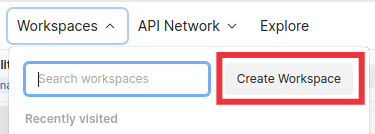
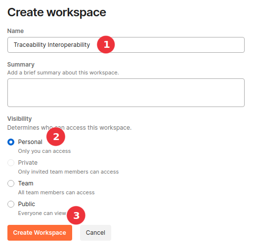
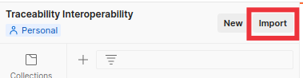
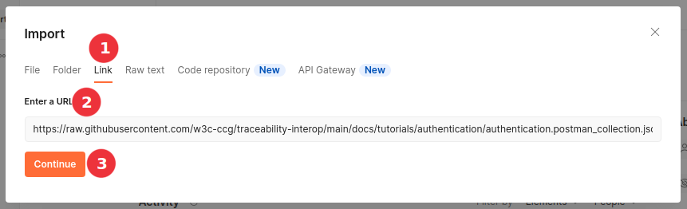
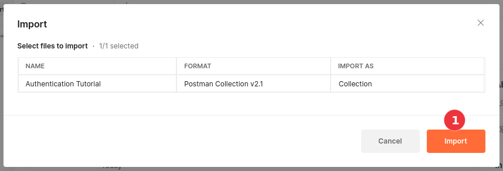
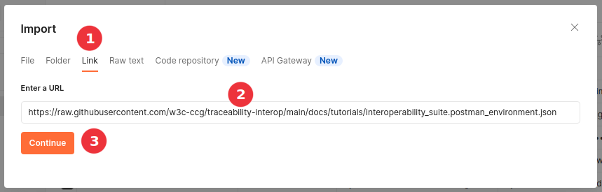
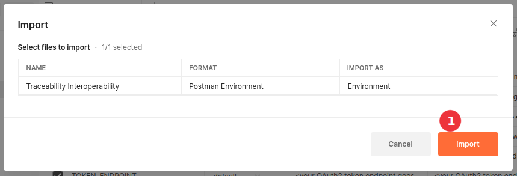
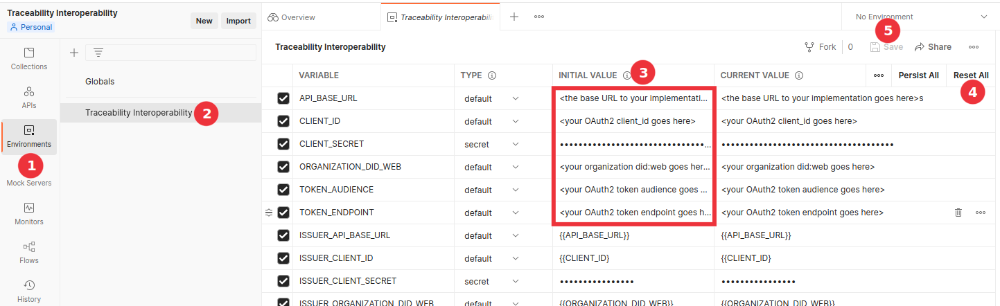

# Traceability Interop Tutorials and Postman Tests

This folder contains the postman tests and tutorials that are executed to demonstrate compliance with the specification.

For a guided tutorial-like experience, please begin with the [authentication](./authentication/) tutorial.

If you are already experienced with using Postman and would like to jump right in with the test suite, please continue reading.

## Importing The Test Suite

### Create a workspace

Postman test suites are imported into workspaces. You may either choose an existing workspace before importing, or create a new one by opening the "Workspaces" dropdown menu at the top left of the Postman window and clicking on the "Create Workspace" button.

In the following examples, the "Traceability Interoperability" workspace will be created and used.

### Import the collections

This test suite contains several different collections to import (repeat the steps in this section for each item in the following list that you wish to import):

- [Authentication Tutorial](https://raw.githubusercontent.com/w3c-ccg/traceability-interop/main/docs/tutorials/authentication/authentication.postman_collection.json)
- [DID Web Discovery Tutorial](https://raw.githubusercontent.com/w3c-ccg/traceability-interop/main/docs/tutorials/did-web-discovery/did-web-discovery.postman_collection.json)
- [Credentials Issue Tutorial](https://raw.githubusercontent.com/w3c-ccg/traceability-interop/main/docs/tutorials/credentials-issue/credentials-issue.postman_collection.json)
- [Credentials Verify Tutorial](https://raw.githubusercontent.com/w3c-ccg/traceability-interop/main/docs/tutorials/credentials-verify/credentials-verify.postman_collection.json)
- [Credentials Revocation Tutorial](https://raw.githubusercontent.com/w3c-ccg/traceability-interop/main/docs/tutorials/credentials-revocation/credentials-revocation.postman_collection.json)
- [Presentations Exchange Tutorial](https://raw.githubusercontent.com/w3c-ccg/traceability-interop/main/docs/tutorials/presentations-exchange/presentations-exchange.postman_collection.json)
- [Presentations Verify Tutorial](https://raw.githubusercontent.com/w3c-ccg/traceability-interop/main/docs/tutorials/presentations-verify/presentations-verify.postman_collection.json)
- [OAuth Presentations Exchange Tutorial](https://raw.githubusercontent.com/w3c-ccg/traceability-interop/main/docs/tutorials/presentations-exchange-oauth/presentations-exchange-oauth.json)
- [VC API - Suite Agility](https://raw.githubusercontent.com/w3c-ccg/traceability-interop/main/docs/tutorials/agility/agility.collection.json)
- [VC API - Issue and Verify Mill Test Report Certificate](https://raw.githubusercontent.com/w3c-ccg/traceability-interop/main/docs/tutorials/mill-test-report-certificate/vc-api.mtrc.collection.json)
- [VC API - VC-JWT Support](https://raw.githubusercontent.com/w3c-ccg/traceability-interop/main/docs/tutorials/vc-jwt/vc-jwt.collection.json)
- [Test Report Demo](https://raw.githubusercontent.com/w3c-ccg/traceability-interop/main/docs/tutorials/report-generation/report-tester.collection.json)
- [Workflow Instance Join](https://raw.githubusercontent.com/w3c-ccg/traceability-interop/main/docs/tutorials/workflow-join/workflow-instance-join.collection.json)

Use the "Import" button to begin importing the interoperability collections. 

When the import modal window opens, select the "Link" option, paste the link to the Postman collection in the text input, and click "Continue". (Links for the postman collections can be found at the beginning of this section.)

After you click "Continue", Postman will download and process the remote url and present a confirmation screen. Click the "Import" button to continue.

Repeat the steps in this section for each collection being imported.

### Import the environment

Use the "Import" button again to import the interoperability environment.

When the import modal window opens, select the "Link" option, paste the [link to the Postman environment](https://raw.githubusercontent.com/w3c-ccg/traceability-interop/main/docs/tutorials/interoperability_suite.postman_environment.json) in the text input, and click "Continue"

After you click "Continue", Postman will download and process the remote url and present a confirmation screen. Click the "Import" button to continue.

### Configure the environment

Once the environment finishes importing, you will need to add in the values specific to your implementation. Click on the "Environments" tab, then highlight the "Traceability Interoperability" environment and update the first six values under the "INITIAL VALUE" column. Click "Reset All" to copy the values to the "CURRENT VALUE" column and then click "Save".

__NOTE: Do not update the variables which start with `ISSUER_` or `VERIFIER_`. These reference the corresponding values from the first six variables and exist because production tests actually use two different providers for interoperability testing. When running locally, you will only have access to your own information, so interop tests will occur using a single implementation.__

You are now ready to begin executing interoperability tests against your implementation!
