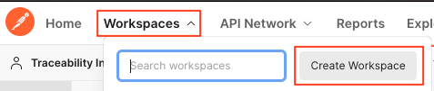
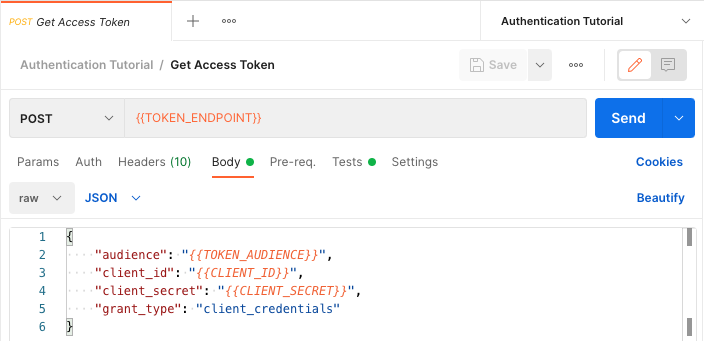
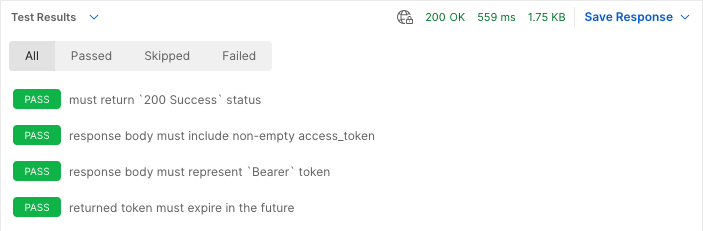

# Authentication Tutorial

If you wish to bypass this tutorial and simply want to import the postman collection locally, copy the "Raw" [link](https://raw.githubusercontent.com/w3c-ccg/traceability-interop/main/docs/tutorials/authentication/authentication.postman_collection.json) to your clipboard and In Postman, Import -> Link -> Paste the "Raw" link. Otherwise, please continue with the rest of the tutorial.

---

This tutorial describes how to obtain an access token for use in making authenticated requests to a VC API endpoint.

## Prerequisites

Before getting started, you must ensure that you have the appropriate software installed locally. Installation of these items is beyond the scope of this document, but instructions can be found for your operating system at the links provided:

* First, download and install [Postman](https://www.postman.com/).
* Second, download and install [Newman](https://learning.postman.com/docs/running-collections/using-newman-cli/command-line-integration-with-newman/).

If you are not already familiar with Postman, we recommend you complete the first few sections of their learning center from the link above.

You may also find it beneficial to review [Oauth.com Documentation](https://www.oauth.com/oauth2-servers/client-registration/client-id-secret/) before proceeding.

## Setup and Configuration

First, create a new Postman workspace to hold all of your Traceability Interoperability related tutorial collections. Click the "Workspaces" dropdown in the main Postman menu, then click the "Create Workspace" button.

Name your new workspace `Traceability Interoperability`.



Start your setup by creating a new Postman collection called `Authentication Tutorial`, and a new Postman environment called `Authentication Tutorial`; all requests and environment variables in this tutorial will be created in these new containers.

## Access Token Request

First, create an access token request along with the supporting environment variable configuration.

### Environment

Add the following variable configuration to the "Authentication Tutorial" Postman environment that you created during setup:

<dl>
  <dt><code>CLIENT_ID</code></dt>
  <dd>The client ID obtained from your OAuth service provider.</dd>
  <dt><code>CLIENT_SCOPE</code></dt>
  <dd>
    Optional. The names of the scopes to request from your OAuth service provider. If your OAuth service provider requires that you name the specific scopes that should be included in the <code>access_token</code> (as Azure does), you should provide a value for this variable.
  </dd>
  <dt><code>CLIENT_SECRET</code></dt>
  <dd>
    The client secret obtained from your OAuth service provider. 🔥 _**Be especially careful with `CLIENT_SECRET`!**_ 🔥 If it is stolen, an attacker can use it to perform all API operations supported by your service provider.
  </dd>
  <dt><code>TOKEN_AUDIENCE</code></dt>
  <dd>
    This value is used to identify the service provider API that the token will be used to access. You may need to configure your identity provider and token endpoint to support this value.
  </dd>
  <dt><code>TOKEN_ENDPOINT</code></dt>
  <dd>
    This is the endpoint used to obtain an access token for Machine-to-Machine connection secured via <code>CLIENT_ID</code> and <code>CLIENT_SECRET</code>.
  </dd>
</dl>

When you are done, the environment should look something like this:


### Request

Create a new `POST` request called `Get Access Token` in the `Authentication Tutorial` collection.
Set the request URL to `{{TOKEN_ENDPOINT}}`, and the request body to the following:

```
{
    "audience": "{{TOKEN_AUDIENCE}}",
    "client_id": "{{CLIENT_ID}}",
    "client_secret": "{{CLIENT_SECRET}}",
    "grant_type": "client_credentials",
    "scope": "{{CLIENT_SCOPE}}"
}
```

When you are done, your request should look something like this:



### Testing

The `Get Access Token` request does not interact with the system under test, but it is nevertheless valuable to validate the response data so that problems which will cause failures in other requests are called out as early as possible.

The following javascript should be added to the "Tests" tab of the "Get Access Token" request:

```javascript
// Token requests are expected to return a `200 Success` response code. Any
// other response code should trigger a failure.
pm.test("must return `200 Success` status", function() {
    pm.response.to.have.status(200);
});

// The response should include an `access_token` value - this will be presented
// to authenticated API endpoints in the `Authentication` header.
pm.test("response body must include non-empty access_token", function () {
    const { access_token } = pm.response.json()
    pm.expect(access_token).to.be.a('string').that.is.not.empty;
});

// The type of `access_token` returned by the token request is expected to be
// `Bearer`.
pm.test("response body must represent `Bearer` token", function() {
    const { token_type } = pm.response.json()
    pm.expect(token_type).to.equal("Bearer");
});

// The returned data includes an `expires_in` field that indicates time until
// token expiration. Validate that this value is a whole number greater than
// zero, as anything less than or equal to zero means that the `access_token`
// is already expired.
pm.test("returned token must expire in the future", function() {
    const { expires_in } = pm.response.json()
    pm.expect(expires_in).to.be.above(0);
});
```

### Running the Request

You can now click the blue "Send" button to make the "Get Access Token" request. If everything works properly, you should receive a response that looks something like this:


If you switch the "Body" dropdown to "Test Results", you should see all tests passing. If any of your tests are failing, you will need to address the underlying issues before moving forward:



## Development

The Postman collection can be run from the command-line using `newman` and a local `.env` file containing your organization's secrets.

Copy the `sample.env` to `.env` and add values relevant to your organization; then use the following example to run the test suite from the command-line.

🔥 _**Be especially careful not to add your secrets to `example.env` or to commit your `.env` file to git.**_ 🔥

### Example: Run postman collection from the command-line
```sh
source .env && \
npx newman run ./authentication.postman_collection.json \
--env-var CLIENT_ID=$CLIENT_ID \
--env-var CLIENT_SCOPE=$CLIENT_SCOPE \
--env-var CLIENT_SECRET=$CLIENT_SECRET \
--env-var TOKEN_AUDIENCE=$TOKEN_AUDIENCE \
--env-var TOKEN_ENDPOINT=$TOKEN_ENDPOINT \
--reporters cli,json
```


