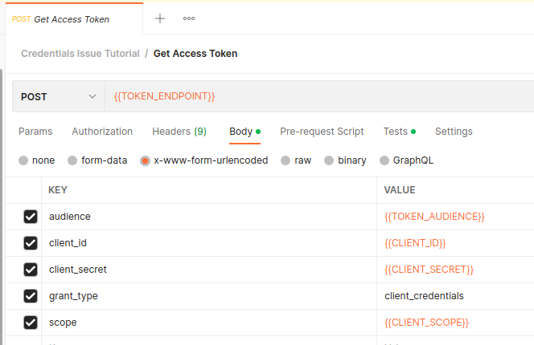
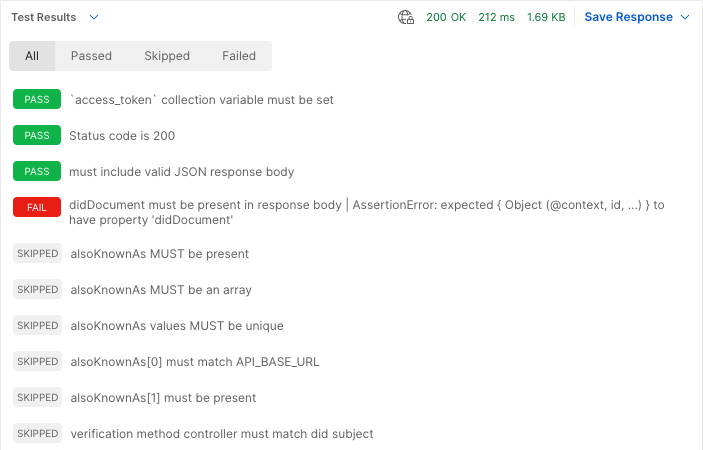
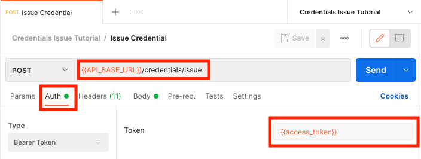
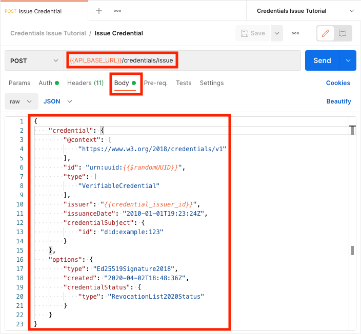
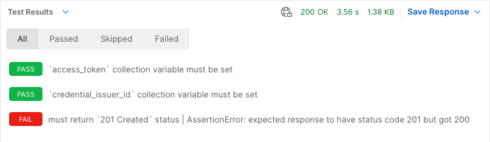

# Credentials Issue Tutorial

If you wish to bypass this tutorial and simply want to import the postman collection locally, copy the "Raw" [link](https://raw.githubusercontent.com/w3c-ccg/traceability-interop/main/docs/tutorials/credentials-issue/credentials-issue.postman_collection.json) to your clipboard and In Postman, Import -> Link -> Paste the "Raw" link. Otherwise, please continue with the rest of the tutorial.

---

If you have not done so already, please review and complete the previous tutorials which form the foundation for the material presented in this tutorial.

1. [Authentication Tutorial](../authentication/README.md) - Obtain an OAuth2 client credentials grant token
1. [Did Web Discovery Tutorial](../did-web-discovery/README.md) - Get Organization identifiers and VC-API service endpoint

In this tutorial we will use the OAuth token from the Authentication Tutorial to make an authenticated call to a VC-API service endpoint obtained from the Did Web Discovery Tutorial to issue a verifiable business card credential.

## Setup and Configuration

Start your setup by creating a new Postman collection called "Credentials Issue Tutorial", and a new Postman environment called "Credentials Issue Tutorial"; all requests and environment variables in this tutorial will be created in these new containers.

_Details on the procedures for creating Postman collections, setting up required the environment, and adding new requests can be found in the [Authentication Tutorial](../authentication/README.md)._

## Access Token Request

This tutorial will be making authenticated requests to a VC-API endpoint, so the first thing you will need to create is an access token request along with the supporting environment variable configuration.

### Environment

For this tutorial, you will need to have the following environment variables configured in Postman:

<dl>
  <dt><code>CLIENT_ID</code></dt>
  <dd>The client ID obtained from your OAuth service provider.</dd>
  <dt><code>CLIENT_SCOPE</code></dt>
  <dd>
    The names of the scopes to request from your OAuth service provider. If your OAuth service provider requires that you name the specific scopes that should be included in the auth token, you should provide a value for this variable.
  </dd>
  <dt><code>CLIENT_SECRET</code></dt>
  <dd>
    The client secret obtained from your OAuth service provider. 🔥 Be especially careful with `CLIENT_SECRET`🔥, If it is stolen it will allow an attacker the ability to perform all api operations supported by your service provider.
  </dd>
  <dt><code>TOKEN_AUDIENCE</code></dt>
  <dd>
    This value is used to identify the service provider API that the token will be used to access. You may need to configure your identity provider and token endpoint to support this value.
  </dd>
  <dt><code>TOKEN_ENDPOINT</code></dt>
  <dd>
    This is the endpoint used to obtain an access token for Machine to Machine connection secured via <code>CLIENT_ID</code> and <code>CLIENT_SECRET</code>.
  </dd>
</dl>

### Request

Create a new `POST` request called "Get Access Token" in the "Credentials Issue Tutorial" collection.
Set the request URL to `{{TOKEN_ENDPOINT}}`, and the request body to the following:

```
{
    "audience": "{{TOKEN_AUDIENCE}}",
    "client_id": "{{CLIENT_ID}}",
    "client_secret": "{{CLIENT_SECRET}}",
    "grant_type": "client_credentials",
    "scope": "{{CLIENT_SCOPE}}"
}
```

When you are done, your request should look something like this:



### Testing

The "Get Access Token" request does not interact with the system under test, but it is nevertheless valuable to validate the response data so that problems which will cause failures in other requests are called out as early as possible. Additionally, the Postman test functionality is used to extract and persist the returned `access_token` for use by later requests.

The following tests should be added to the "Get Access Token" request in the "Tests" tab:

```javascript
// Token requests are expected to return a `200 Success` response code. Any
// other response code should trigger a failure.
pm.test("must return `200 Success` status", function() {
    pm.response.to.have.status(200);
});

// The response should include an `access_token` value - this will be presented
// to authenticated API endpoints in the `Authentication` header (see the last
// testing code block for details on how this is persisted).
pm.test("response body must include non-empty access_token", function () {
    const { access_token } = pm.response.json()
    pm.expect(access_token).to.be.a('string').that.is.not.empty;
});

// The type of `access_token` returned by the token request is expected to be
// `Bearer`.
pm.test("response body must represent `Bearer` token", function() {
    const { token_type } = pm.response.json()
    pm.expect(token_type).to.equal("Bearer");
});

// The returned data includes an `expires_in` field that indicates time until
// token expiration. Validate that this value is a whole number greater than
// zero, as anything less than or equal to zero means that the `access_token`
// is already expired.
pm.test("returned token must expire in the future", function() {
    const { expires_in } = pm.response.json()
    pm.expect(expires_in).to.be.above(0);
});

// The returned `access_token` value is persisted as a Postman collection
// variable that can be accessed by other requests in the collection by calling
// `pm.collectionVariables.get("access_token")`.
pm.test("`access_token` persisted to collectionVariables", function() {
    const { access_token } = pm.response.json()
    pm.collectionVariables.set("access_token", access_token);
});
```

### Running the Request

You can now click the blue "Send" button to make the "Get Access Token" request. If everything works properly, you should receive a response that looks something like this:


If you switch the "Body" dropdown to "Test Results", you should see all tests passing. If any of your tests are failing, you will need to address the underlying issues before moving forward:


## Get Organization DIDs

In this tutorial, we will be using DID Web Discovery to find the base URL for a VC-API that supports presentation exchange as well as a DID to use for issuing credentials.

### Environment

For this tutorial, you will need to have the following environment variables configured in Postman:

<dl>
  <dt><code>API_BASE_URL</code></dt>
  <dd>The base URL for your organizations VC-API supporting DID resolution.</dd>
  <dt><code>ORGANIZATION_DID_WEB</code></dt>
  <dd>Your organization's DID Web, <em>e.g.</em>, <code>did:web:api.did.actor:api</code></dd>
</dl>

### Request

Create a new `GET` request called "Get Organization DIDs" in the "Credentials Issue Tutorial" collection.
* Set the request URL to `{{API_BASE_URL}}/identifiers/{{ORGANIZATION_DID_WEB}}`.
* In the "Auth" tab, add `{{access_token}}` as the "Token" value.
* In the "Headers" tab, dd an `Accept` header with the value `application/json`.

When you are done, your request should look something like this:


### Testing

The "Get Organization DIDs" request is part of the system under test, and as such the interaction must be validated using Postman tests.

Some of the tests have dependencies on other tests. To facilite skipping tests when their prerequisite conditions have not been met, we take advantage of Postman's `pm.test.skip` functionality to create variables to use as placeholders for the test functions. When a prerequisite is met, the placeholder is changed from `pm.test.skip` to `pm.test` so that the dependent test can be executed.

_NOTE: Any skipped test MUST be considered a failure, they are just spipped to control test noise when they are guaranteed to fail based on previously evaluated conditions._

The following code should be added to the "Get Organization DIDs" request in the "Tests" tab:

```javascript
// This endpoint is authenticated. This test will not prevent the request from
// running when the `access_token` collection variable is missing, but it will
// give an indication of why the request failed in that scenario.
pm.test("`access_token` collection variable must be set", function () {
    const access_token = pm.collectionVariables.get("access_token");
    pm.expect(access_token).to.be.a('string').that.is.not.empty;
});

pm.test("Status code is 200", function () {
    pm.response.to.have.status(200);
});

pm.test("must include valid JSON response body", function() {
    pm.response.json(); // will throw on parse failure
});

// The response JSON must include a didDocument property that contains the
// resolved DID document.
pm.test("didDocument must be present in response body", function() {
    const jsonData = pm.response.json();
    pm.expect(jsonData).to.have.property('didDocument');
});

// If a verificationMethod property is present, the controller property must
// match the didDocument.id property.
pm.test("verification method controller must match did subject", function() {
    const { didDocument } = pm.response.json();
    const vm = didDocument.verificationMethod || [];
    vm.forEach((m) => pm.expect(m.controller).to.equal(didDocument.id));
});

// The value of didDocument.id is persisted as a Postman collection variable
// that can be accessed by other requests in the collection by calling
// pm.collectionVariables.get("credential_issuer_id").
pm.test("`credential_issuer_id` persisted to collectionVariables", function() {
    const { didDocument } = pm.response.json();
    pm.collectionVariables.set("credential_issuer_id", didDocument.id);
});
```

### Running the Request

You can now click the blue "Send" button to make the "Get Organization DIDs" request. If everything works properly, you should receive a response that looks something like this:


If you switch the "Body" dropdown to "Test Results", you should see all tests passing. If any of your tests are failing (like in the following example), you will need to address the underlying issues before moving forward.



## Issue Credential

In this tutorial, we will be using the `credentials_issuer_id` and `access_token` from previous steps to issue a verifiable credential.

### Environment

For this tutorial, you will need to have the following environment variables configured in Postman:

<dl>
  <dt><code>API_BASE_URL</code></dt>
  <dd>The base URL for your organizations VC-API supporting credential issuance.</dd>
</dl>

### Request

Create a new `GET` request called "Issue Credential" in the "Credentials Issue Tutorial" collection.

* Set the request URL to `{{API_BASE_URL}}/credentials/issue`.
* In the "Auth" tab, add `{{access_token}}` as the "Token" value.
* In the "Headers" tab, dd an `Accept` header with the value `application/json`.
* In the body tab, add the following JSON:
  ```json
  {
      "credential": {
          "@context": [
              "https://www.w3.org/2018/credentials/v1"
          ],
          "id": "urn:uuid:{{$randomUUID}}",
          "type": [
              "VerifiableCredential"
          ],
          "issuer": "{{credential_issuer_id}}",
          "issuanceDate": "2010-01-01T19:23:24Z",
          "credentialSubject": {
              "id": "did:example:123"
          }
      },
      "options": {
          "type": "Ed25519Signature2018",
          "created": "2020-04-02T18:48:36Z",
          "credentialStatus": {
              "type": "StatusList2021Entry"
          }
      }
  }
  ```

When you are done, your request should look something like this:





### Testing

The "Issue Credentials" request is part of the system under test, and as such the interaction must be validated using Postman tests.

The following code should be added to the "Issue Credentials" request in the "Tests" tab:

The `/credentials/issue` endpoint is authenticated. This test will not prevent the request from running when the `access_token` collection variable is missing, but it will give an indication of why the request failed in that scenario.

```javascript
pm.test("`access_token` collection variable must be set", function () {
    pm.expect(pm.collectionVariables.get("access_token")).to.not.be.undefined;
});
```

The `credential_issuer_id` from the "Get Organization DIDs" request is used to populate part of the request body. If this collection variable is missing, the request will not be prevented, but this test will raise an error that will help to identify the problem.

```javascript
pm.test("`credential_issuer_id` collection variable must be set", function () {
    pm.expect(pm.collectionVariables.get("credential_issuer_id")).to.not.be.undefined;
});
```

The expected response code for a "Credentials Issue" request is `201 Created`.

```javascript
pm.test("must return `201 Created` status", function () {
    pm.response.to.have.status(201);
});
```

### Running the Request

You can now click the blue "Send" button to make the "Credentials Issue" request. If everything works properly, you should receive a response that contains a verifiable credential:


If you switch the "Body" dropdown to "Test Results", you should see all tests passing. If any of your tests are failing (like in the following example), you will need to address the underlying issues before moving forward.



## Development

The postman collection can be run from the colland-line using `newman` and a local `.env` file containing your organizations secrets.

_Example: Run postman collection from the command-line_
```sh
source .env && \
npx newman run ./credentials-issue.postman_collection.json \
--env-var ORGANIZATION_DID_WEB=$ORGANIZATION_DID_WEB \
--env-var CLIENT_ID=$CLIENT_ID \
--env-var CLIENT_SCOPE=$CLIENT_SCOPE \
--env-var CLIENT_SECRET=$CLIENT_SECRET \
--env-var TOKEN_AUDIENCE=$TOKEN_AUDIENCE \
--env-var TOKEN_ENDPOINT=$TOKEN_ENDPOINT \
--env-var API_BASE_URL=$API_BASE_URL \
--reporters cli,json
```


