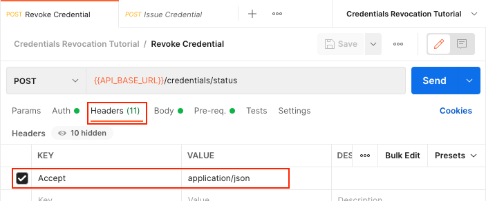
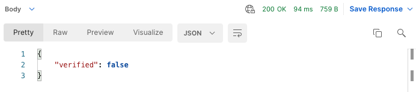
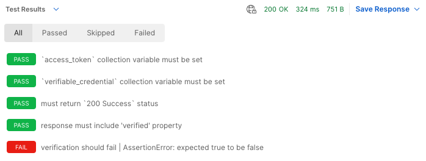

# Credentials Revocation Tutorial

If you wish to bypass this tutorial and simply want to import the postman collection locally, copy the "Raw" [link](https://raw.githubusercontent.com/w3c-ccg/traceability-interop/main/docs/tutorials/credentials-revocation/credentials-revocation.postman_collection.json) to your clipboard and In Postman, Import -> Link -> Paste the "Raw" link. Otherwise, please continue with the rest of the tutorial.

#

If you have not done so already, please review and complete the previous tutorials which form the foundation for the material presented in this tutorial.

1. [Authentication Tutorial](../authentication/README.md) - Obtain an OAuth2 client credentials grant token
1. [Did Web Discovery Tutorial](../did-web-discovery/README.md) - Get Organization identifiers and VC-API service endpoint
1. [Credentials Issue Tutorial](../credentials-issue/README.md) - Issue a verifiable credential
1. [Credentials Verify Tutorial](../credentials-verify/README.md) - Verify a verifiable credential

In this tutorial, we will be revoking a previously issued and verified verifiable credential from the Credentials Issue Tutorial workflow, and then validating that is has been properly revoked.

## Setup and Configuration

This tutorial will be picking up where the Credentials Verify Tutorial left off; the quickest way to get set up to work on this tutorial is to:

1. Duplicate the Credentials Verify Tutorial and rename it to Credentials Revocation Tutorial.
1. Duplicate the Credentials Verify Environment and rename it to Credentials Revocation Environment.

Be sure to activate the new Credentials Revocation Environment by selecting it in the drop-down menu at the top-right of the Postman interface.


## Revoke Credential

In this tutorial, we will be using the `verifiable_credential_id` and `access_token` from previous steps to revoke a verifiable credential.

### Environment

No additional environment variables are needed for this request, all required environment variables were set during the tutorial steps for previous requests.

### Request

Create a new `POST` request called "Revoke Credentials" in the "Credentials Revocation Tutorial" collection.

* Set the request URL to `{{API_BASE_URL}}/credentials/status`.
* In the "Auth" tab, select "Bearer Token" set the "Token" value to `{{access_token}}`.
* In the "Headers" tab, dd an `Accept` header with the value `application/json`.
* In the body tab, add the following raw JSON:
  ```json
  {
    "credentialId": "{{verifiable_credential_id}}",
    "credentialStatus": [{ "type": "RevocationList2020Status", "status": "1" }]
  }
  ```
* In the "Pre-Req." tab:
  ```json
  // Extract credential ID from verifiable credential
  let verifiable_credential_id;
  try {
      const {credential} = pm.collectionVariables.get("verifiable_credential");
      verifiable_credential_id = credential.id;
  } catch {}
  ```

When you are done, your request should look something like this:





### Testing

The "Revoke Credentials" request is part of the system under test, and as such the interaction must be validated using Postman tests.

The following code should be added to the "Revoke Credentials" request in the "Tests" tab:

```javascript
// The `/credentials/status` endpoint is authenticated. This test will not
// prevent the request from running when the `access_token` collection variable
// is missing, but it will give an indication of why the request failed in that
// scenario.
pm.test("`access_token` collection variable must be set", function () {
    pm.expect(pm.collectionVariables.get("access_token")).to.not.be.undefined;
});

// Verifiable credential ID is a required element item used in the request body
pm.test("`verifiable_credential_id` local variable must be set", function () {
    pm.expect("verifiable_credential").to.be.a('string').that.is.not.empty;
});

// The expected response code for a "Revoke Credentials" request is `200 Success`
pm.test("must return `200 Success` status", function () {
    pm.response.to.have.status(200);
});
```

### Running the Request

You can now click the blue "Send" button to make the "Revoke Credentials" request. If everything works properly, you should receive an empty `200 OK` response.

If you switch the "Body" dropdown to "Test Results", you should see all tests passing. If any of your tests are failing (like in the following example), you will need to address the underlying issues before moving forward.


## Verify Revocation

In this tutorial, we will be re-running the "Verify Credential" request, but this time with the expectation that the verification will fail.

### Environment

No additional environment variables are needed for this request, all required environment variables were set during the tutorial steps for previous requests.

### Request

Duplicate the "Verify Credential" request already present in the "Credentials Revocation Tutorial" and name it "Verify Revocation"

### Testing

Make the following changes to the javascript tests on the "Tests" tab of the "Verify Revocation" request:

```diff
- // The verification should succeed.
- pm.test("verification should be successful", function() {
-     const { verified } = pm.response.json()
-     pm.expect(verified).to.be.true;
- });
+ // The verification should fail.
+ pm.test("verification should fail", function() {
+     const { verified } = pm.response.json()
+     pm.expect(verified).to.be.a('boolean').that.is.false;
+ });
```

### Running the Request

You can now click the blue "Send" button to make the "Revoke Credentials" request. If everything works properly, you should receive a`200 OK` response with a verification status in the body:



If you switch the "Body" dropdown to "Test Results", you should see all tests passing. If any of your tests are failing (like in the following example), you will need to address the underlying issues before moving forward.



## Development

The postman collection can be run from the colland-line using `newman` and a local `.env` file containing your organizations secrets.

_Example: Run postman collection from the command-line_
```sh
source .env && \
npx newman run ./credentials-revocation.postman_collection.json \
--env-var ORGANIZATION_DID_WEB=$ORGANIZATION_DID_WEB \
--env-var CLIENT_ID=$CLIENT_ID \
--env-var CLIENT_SECRET=$CLIENT_SECRET \
--env-var TOKEN_AUDIENCE=$TOKEN_AUDIENCE \
--env-var TOKEN_ENDPOINT=$TOKEN_ENDPOINT \
--env-var API_BASE_URL=$API_BASE_URL \
--reporters cli,json
```
