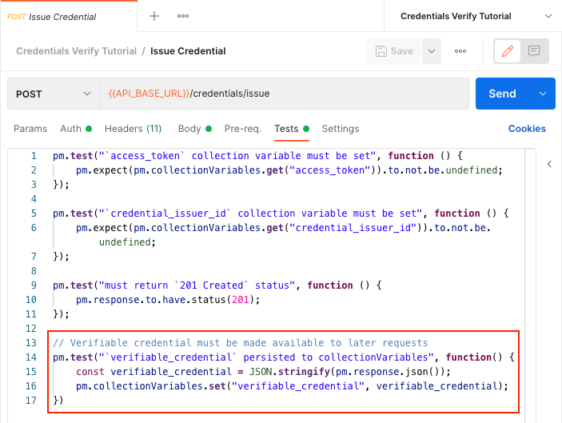
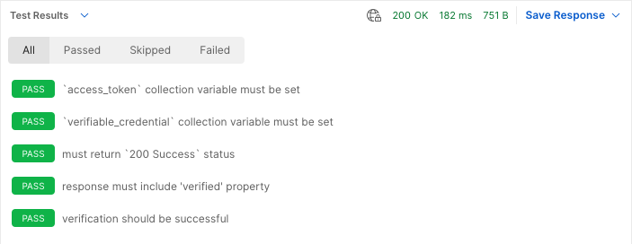

# Credentials Verify Tutorial

If you have not done so already, please review and complete the previous tutorials which form the foundation for the material presented in this tutorial.

1. [Authentication Tutorial](../authentication/README.md) - Obtain an OAuth2 client credentials grant token
1. [Did Web Discovery Tutorial](../did-web-discovery/README.md) - Get Organization identifiers and VC-API service endpoint
1. [Credentials Issue Tutorial](../credentials-issue/README.md) - Issue a verifiable credential

In this tutorial we will use the OAuth token from the Authentication Tutorial to make an authenticated call to a VC-API service endpoint obtained from the Did Web Discovery Tutorial to verify a verifiable business card credential that was previously issued through the Credentials Issue Tutorial workflow.

## Setup and Configuration

This tutorial will be picking up where the Credentials Issue Tutorial left off; the quickest way to get set up to work on this tutorial is to:

1. Duplicate the Credentials Issue Tutorial and rename it to Credentials Verify Tutorial.
1. Duplicate the Credentials Issue Environment and rename it to Credentials Verify Environment.

Be sure to activate the new Credentials Issue Environment by selecting it in the drop-down menu at the top-right of the Postman interface.


## Issue Credential

The first thing that we need to do is preserve the output of the Issue Credential request so that we can use that credential in the Verify Credential step.

Open up the "Issue Credential" request in the "Credentials Issue Tutorial" and select the "Tests" tab; Add the following code to the end of the test so that the verifiable credential JSON is stored as a collection variable:

```javascript
// Verifiable credential must be made available to later requests
pm.test("`verifiable_credential` persisted to collectionVariables", function() {
    const verifiable_credential = JSON.stringify(pm.response.json());
    pm.collectionVariables.set("verifiable_credential", verifiable_credential);
})
```

When you are done, the "Tests" tab should look something like this:



You will need to run this request at least once in order to populate the `verifiable_credential` collection variable before you can proceed with the next request.

## Verify Credential

In this tutorial, we will be using the `verifiable_credential` and `access_token` from previous steps to verify a verifiable credential.

### Environment

No additional environment variables are needed for this request, all required environment variables were set during the tutorial steps for previous requests.

### Request

Create a new `POST` request called "Verify Credential" in the "Credentials Verify Tutorial" collection.

* Set the request URL to `{{API_BASE_URL}}/credentials/verify`.
* In the "Auth" tab, select "Bearer Token" set the "Token" value to `{{access_token}}`.
* In the "Headers" tab, dd an `Accept` header with the value `application/json`.
* In the body tab, add the following raw JSON:
  ```json
  {
      "verifiableCredential": {{verifiable_credential}}
  }
  ```

When you are done, your request should look something like this:


### Testing

The "Verify Credentials" request is part of the system under test, and as such the interaction must be validated using Postman tests.

The following code should be added to the "Verify Credentials" request in the "Tests" tab:

```javascript
// The `/credentials/verify` endpoint is authenticated. This test will not
// prevent the request from running when the `access_token` collection variable
// is missing, but it will give an indication of why the request failed in that
// scenario.
pm.test("`access_token` collection variable must be set", function () {
    pm.expect(pm.collectionVariables.get("access_token")).to.not.be.undefined;
});

// The `verifiable_credential` from the "Credentials Issue" request is used to
// populate part of the request body. If this collection variable is missing,
// the request will not be prevented, but this test will raise an error that
// will help to identify the problem.
pm.test("`verifiable_credential` collection variable must be set", function () {
    pm.expect(pm.collectionVariables.get("verifiable_credential")).to.not.be.undefined;
});

// The expected response code for a "Credentials Verify" request is
// `200 Success`.
pm.test("must return `200 Success` status", function () {
    pm.response.to.have.status(200);
});

// The response body must include a "verified" property indicating whether or
// not the verification was successful.
pm.test("response must include 'verified' property", function() {
    const { verified } = pm.response.json()
    pm.expect(verified).to.not.be.undefined;
});

// The verification should succeed.
pm.test("verification should be successful", function() {
    const { verified } = pm.response.json()
    pm.expect(verified).to.be.true;
});
```

### Running the Request

You can now click the blue "Send" button to make the "Verify Credentials" request. If everything works properly, you should receive a response that indicates whether or not the credential could be verified:


If you switch the "Body" dropdown to "Test Results", you should see all tests passing. If any of your tests are failing, you will need to address the underlying issues before moving forward.



## Development

The postman collection can be run from the colland-line using `newman` and a local `.env` file containing your organizations secrets.

_Example: Run postman collection from the command-line_
```sh
source .env && \
npx newman run ./credentials-verify.postman_collection.json \
--env-var ORGANIZATION_DID_WEB=$ORGANIZATION_DID_WEB \
--env-var CLIENT_ID=$CLIENT_ID \
--env-var CLIENT_SECRET=$CLIENT_SECRET \
--env-var TOKEN_AUDIENCE=$TOKEN_AUDIENCE \
--env-var TOKEN_ENDPOINT=$TOKEN_ENDPOINT \
--env-var API_BASE_URL=$API_BASE_URL \
--reporters cli,json
```
