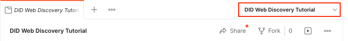
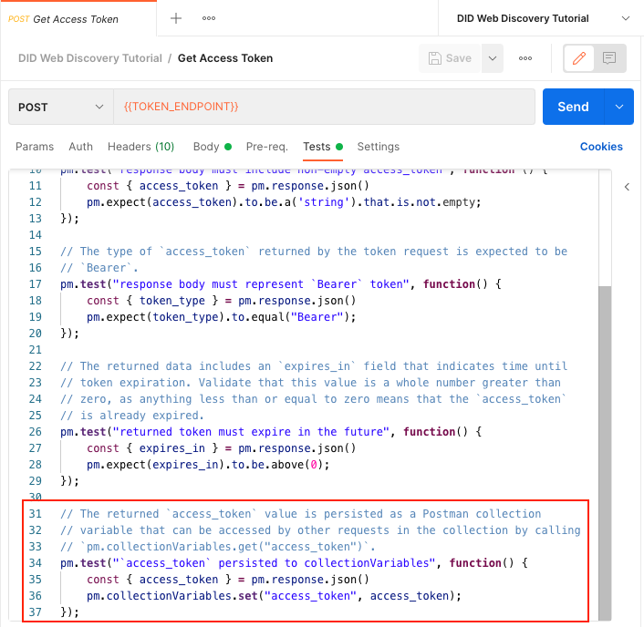
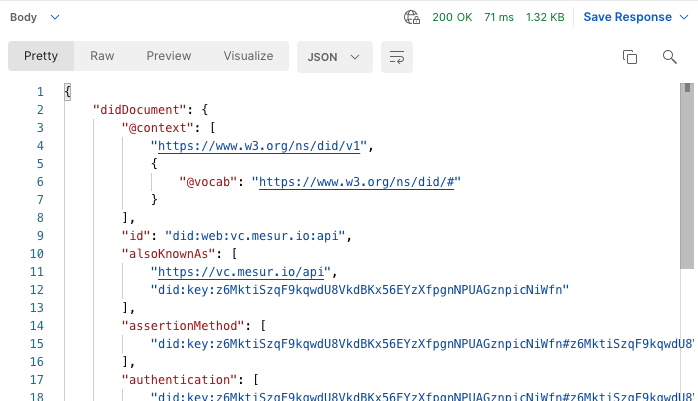
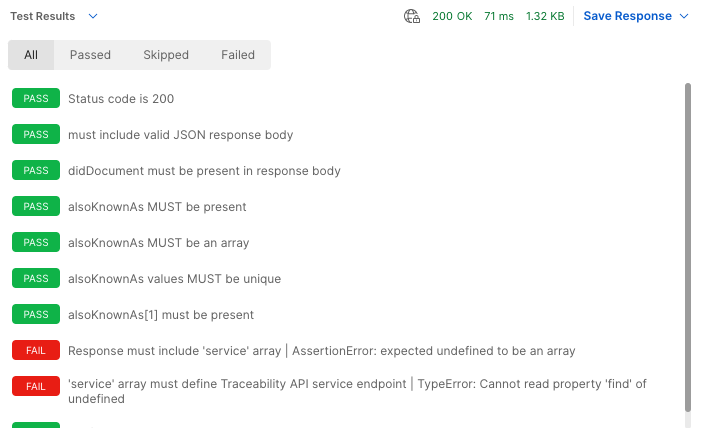

# DID Web Discovery Tutorial

If you have not done so already, please review and complete the previous tutorials which form the foundation for the material presented in this tutorial.

1. [Access Token Tutorial](../authentication/README.md) - Obtain an OAuth2 client credentials grant token

In this tutorial, we will be using DID Web Discovery to find the base URL for a VC-API that supports presentation exchange as well as a DID to use for issuing credentials.

## Setup and Configuration

This tutorial will be picking up where the Access Token Tutorial left off; the quickest way to get set up to work on this tutorial is to:

1. Duplicate the Access Token Tutorial and rename it to DID Web Discovery Tutorial.
1. Duplicate the Access Token Environment and rename it to DID Web Discovery Environment.

Be sure to activate the new DID Web Discovery Environment by selecting it in the drop-down menu at the top-right of the Postman interface.



## Access Token Request

The first thing that we need to do is preserve the output of the Get Access Token request so that we can use the created access token for authenticated requests to the VC API endpoint.

Open up the "Get Access Token" request in the "Get Access Token Tutorial" and select the "Tests" tab. Add the following code to the end of the test so that the access token is stored as a collection variable:

```javascript
// The returned `access_token` value is persisted as a Postman collection
// variable that can be accessed by other requests in the collection by calling
// `pm.collectionVariables.get("access_token")`.
pm.test("`access_token` persisted to collectionVariables", function() {
    const { access_token } = pm.response.json()
    pm.collectionVariables.set("access_token", access_token);
});
```

When you are done, the "Tests" tab should look something like this:



You will need to run this request at least once in order to populate the `access_token` collection variable before you can proceed with the next request.

## Get Organization DIDs

In this tutorial, we will be using DID Web Discovery to find the base URL for a VC-API that supports presentation exchange as well as a DID to use for issuing credentials.

### Environment

For this tutorial, you will need to add the following environment variables to the DID Web Discovery Environment:

<dl>
  <dt><code>API_BASE_URL</code></dt>
  <dd>The base URL for your organizations VC-API supporting DID resolution.</dd>
  <dt><code>ORGANIZATION_DID_WEB</code></dt>
  <dd>Your organization's DID Web, <em>e.g.</em>, <code>did:web:api.did.actor:api</code></dd>
</dl>

### Request

Create a new `GET` request called "Get Organization DIDs" in the "DID Web Discovery Tutorial" collection.
* Set the request URL to `{{API_BASE_URL}}/identifiers/{{ORGANIZATION_DID_WEB}}`.
* In the "Auth" tab, add `{{access_token}}` as the "Token" value.
* In the "Headers" tab, dd an `Accept` header with the value `application/json`.

When you are done, your request should look something like this:


### Testing

The "Get Organization DIDs" request is part of the system under test, and as such the interaction must be validated using Postman tests. Add the following code to the "Tests" tab in the "Get Organization DIDs" request:

```javascript
pm.test("Status code is 200", function () {
    pm.response.to.have.status(200);
});

pm.test("must include valid JSON response body", function() {
    pm.response.json(); // will throw on parse failure
});

// The response JSON must include a didDocument property that contains the
// resolved DID document.
pm.test("didDocument must be present in response body", function() {
    const jsonData = pm.response.json();
    pm.expect(jsonData).to.have.property('didDocument');
});

// The DID document must contain an alsoKnownAs property.
pm.test("alsoKnownAs MUST be present", function () {
    const { didDocument } = pm.response.json();
    pm.expect(didDocument).to.have.property('alsoKnownAs');
});

// The alsoKnownAs property MUST be an array.
pm.test("alsoKnownAs MUST be an array", function() {
    const { alsoKnownAs } = pm.response.json().didDocument;
    pm.expect(alsoKnownAs).to.be.an('array');
});

// The alsoKnownAs property MUST be a set.
pm.test("alsoKnownAs values MUST be unique", function() {
    const { alsoKnownAs } = pm.response.json().didDocument;
    pm.expect(new Set(alsoKnownAs)).to.have.lengthOf(alsoKnownAs.length);
});

// The second element of the alsoKnownAs property will be used as a
// credentials_issuer_id for subsequent tests.
pm.test("alsoKnownAs[1] must be present", function() {
    const { alsoKnownAs } = pm.response.json().didDocument;
    pm.expect(alsoKnownAs[1]).to.be.a('string').that.is.not.empty;
});

// Service array is used to look up traceability API service endpoint
pm.test("Response must include 'service' array", function() {
    const { service } = pm.response.json().didDocument;
    pm.expect(service).to.be.an('array').that.is.not.empty;
});

// Service array must be correctly defined in DID document
pm.test("'service' array must define Traceability API service endpoint", function() {
    const { service } = pm.response.json().didDocument;
    const entry = service.find((s) => s.type == "TraceabilityAPI");
    pm.expect(entry).to.be.an('object').that.is.not.empty;
    pm.expect(entry.serviceEndpoint).to.be.a('string').that.is.not.empty;
});

// If a verificationMethod property is present, the controller property must
// match the didDocument.id property.
pm.test("verification method controller must match did subject", function() {
    const { didDocument } = pm.response.json();
    const vm = didDocument.verificationMethod || [];
    vm.forEach((m) => pm.expect(m.controller).to.equal(didDocument.id));
});
```

### Running the Request

You can now click the blue "Send" button to make the "Get Organization DIDs" request. If everything works properly, you should receive a response that looks something like this:



If you switch the "Body" dropdown to "Test Results", you should see all tests passing. If any of your tests are failing (like in the following example), you will need to address the underlying issues before moving forward.



## Development

The postman collection can be run from the colland-line using `newman` and a local `.env` file containing your organizations secrets.

Copy the _sample.env_ to _.env_ and add values relevant to your organization, then use the following example to run the test suite from the command-line.

🔥 Be especially careful not to add your secrets to _example.env_ or to commit your _.env_ file to git. 🔥

_Example: Run postman collection from the command-line_
```sh
source .env && \
npx newman run ./did-web-discovery.postman_collection.json \
--env-var ORGANIZATION_DID_WEB=$ORGANIZATION_DID_WEB \
--env-var CLIENT_ID=$CLIENT_ID \
--env-var CLIENT_SECRET=$CLIENT_SECRET \
--env-var TOKEN_AUDIENCE=$TOKEN_AUDIENCE \
--env-var TOKEN_ENDPOINT=$TOKEN_ENDPOINT \
--env-var API_BASE_URL=$API_BASE_URL \
--reporters cli,json
```
