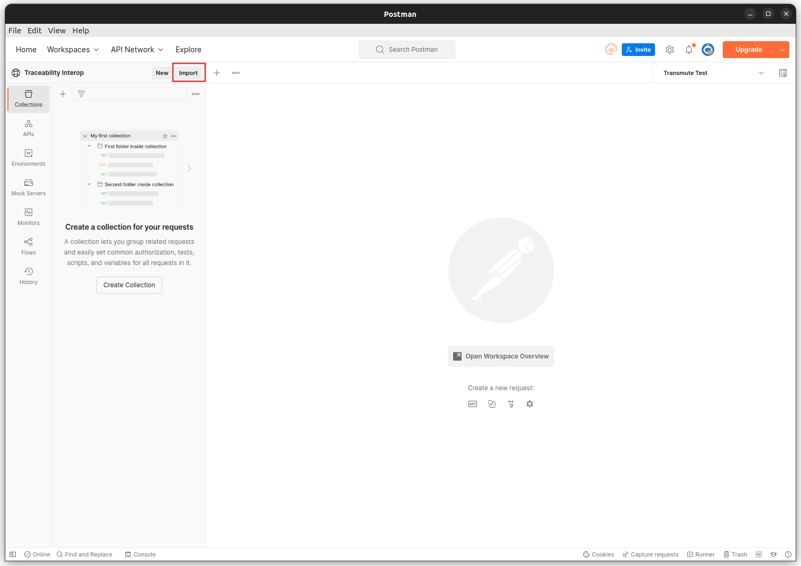
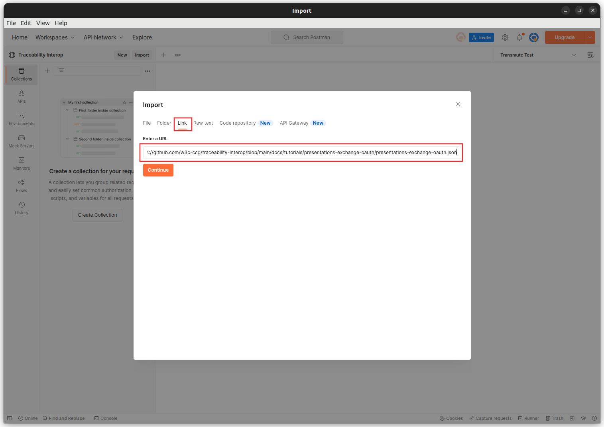
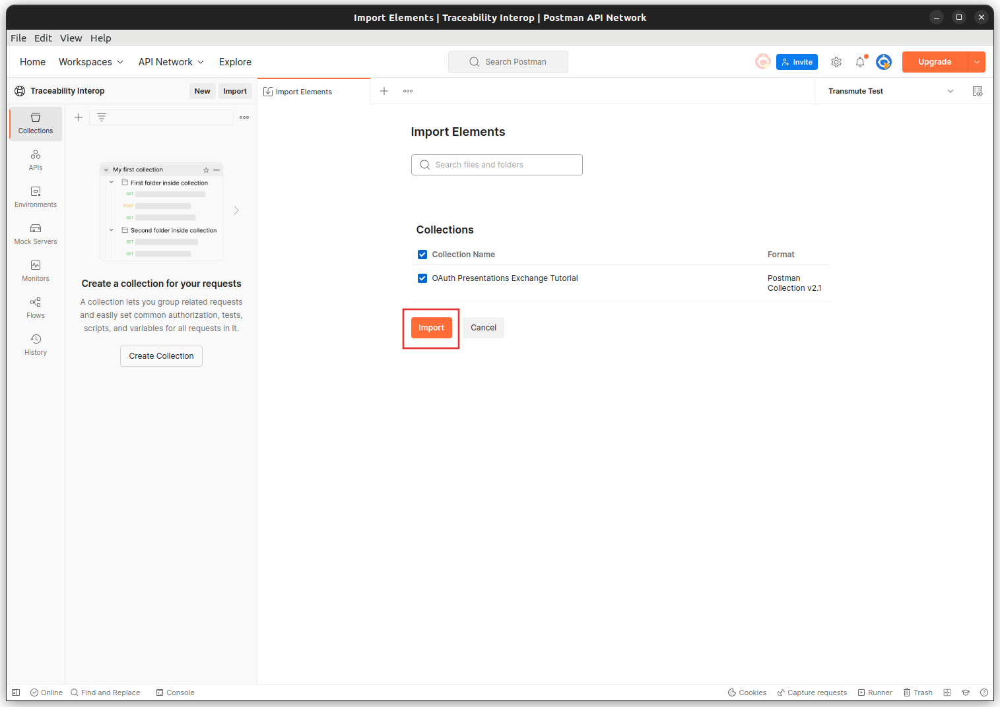
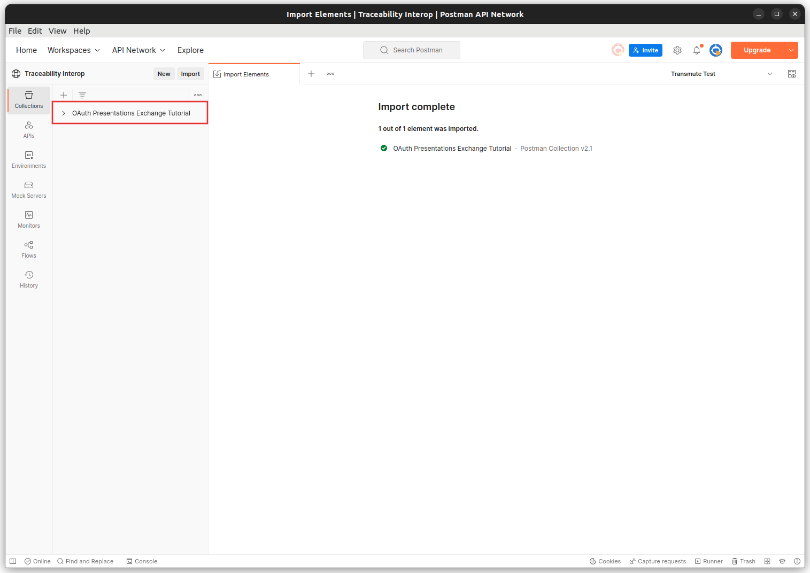

# Traceability Interop Postman Collection Setup

This guide provides instructions on how to set up and run the Traceability Interop Postman Collection, [`presentations-exchange-oauth.json`](https://github.com/w3c-ccg/traceability-interop/blob/main/docs/tutorials/presentations-exchange-oauth/presentations-exchange-oauth.json).

## Prerequisites

- [Postman](https://www.postman.com/) must be installed on your computer.

## Setting Up the Collection

Open Postman and click on the "Import" button in the top left corner of the window.

In the Import dialog, select the "Link" tab, enter the url `https://raw.githubusercontent.com/w3c-ccg/traceability-interop/main/docs/tutorials/presentations-exchange-oauth/presentations-exchange-oauth.json`, and click `Continue`.

You will be asked to confirm the import.

After the collection has been imported, you should see a new collection in your Postman Workspace named "Traceability Interop".

## Setting Up the Environment

1. Click on the "Settings" icon in the top right corner of the Postman window and select "Manage Environments".
2. Click on the "Add" button to create a new environment.
3. Give the environment a name, such as "Traceability Interop Environment".
4. Add the following variables to the environment, replacing the placeholders with your own values:
   - `base_url`: The base URL for the Traceability Interop API.
   - `client_id`: The client ID for your OAuth application.
   - `client_secret`: The client secret for your OAuth application.
5. Save the environment by clicking on the "Add" button.

## Running the Collection

1. Select the "Traceability Interop" collection in the Postman Workspace.
2. In the top right corner of the Postman window, select the environment you just created from the dropdown list.
3. Click on the "Runner" button in the top right corner of the window to open the Collection Runner.
4. In the Collection Runner, select the "Traceability Interop" collection and the environment you created earlier.
5. Click on the "Start Test" button to run the collection.
6. Observe the results of the API requests in the Collection Runner. The responses from the API will be displayed in the "Tests" tab for each request.
7. If a request fails, you can examine the response to see what went wrong.

By following these steps, you should now be able to successfully run the Traceability Interop Postman Collection and test the Traceability Interop API.
