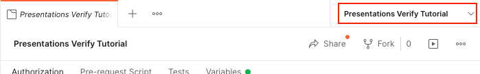
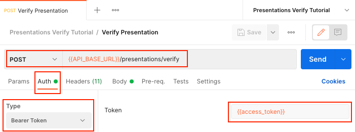
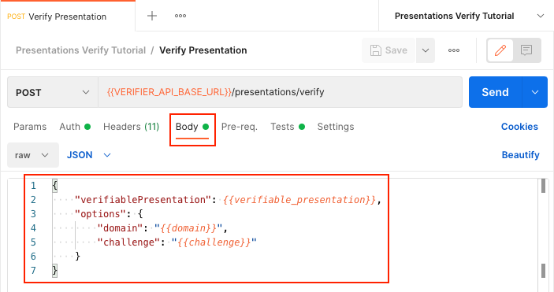
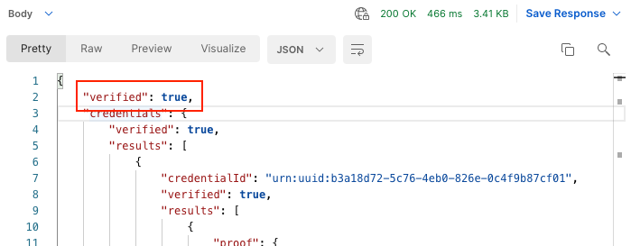
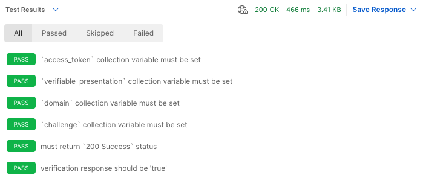

# Presentations Verify Tutorial

If you have not done so already, please review and complete the previous tutorials which form the foundation for the material presented in this tutorial.

1. [Authentication Tutorial](../authentication/README.md) - Obtain an OAuth2 client credentials grant token
1. [Did Web Discovery Tutorial](../did-web-discovery/README.md) - Get Organization identifiers and VC-API service endpoint
1. [Credentials Issue Tutorial](../credentials-issue/README.md) - Issue a verifiable credential
1. [Presentations Exchange Tutorial](../presentations-exchange/README.md) - Issue a verifiable presentation

In this tutorial we will use the OAuth token from the Authentication Tutorial to make an authenticated call to a VC-API service endpoint obtained from the Did Web Discovery Tutorial verify a previously issued verifiable presentation.

## Setup and Configuration

This tutorial picks up where the Presentations Exchange Tutorial left off; the quickest way to get set up to work on this tutorial is to —

1. Duplicate the "Presentations Exchange Tutorial" collection and rename it to "Presentations Verify Tutorial".
1. Duplicate the "Presentations Exchange Tutorial" environment and rename it to "Presentations Verify Tutorial".

Be sure to activate the new "Presentations Verify Tutorial" environment by selecting it in the drop-down menu at the top-right of the Postman interface.



## Verify Presentation

Verification of a presentation is performed by presenting a verifiable presentation to the `/presentations/verify` endpoint.

### Environment

No additional environment variables are needed for this request, all required environment variables were set during the tutorial steps for previous requests.

### Request

Create a new `POST` request called "Verify Presentation" in the "Presentations Verify Tutorial" collection.

* Set the request URL to `{{VERIFIER_API_BASE_URL}}/presentations/verify`.
* In the "Auth" tab, select "Bearer Token" set the "Token" value to `{{verifier_access_token}}`.
* In the "Headers" tab, dd an `Accept` header with the value `application/json`.
* In the body tab, add the following raw JSON:
  ```json
  {
      "verifiablePresentation": {{verifiable_presentation}},
      "options": {
          "domain": "{{domain}}",
          "challenge": "{{challenge}}"
      }
  }
  ```

When you are done, your request should look something like this:





### Testing

The "Verify Presentation" request is part of the system under test, and as such the interaction must be validated using Postman tests.

The following code should be added to the "Verify Presentation" request in the "Tests" tab:

```javascript
// This endpoint is authenticated. This test will not prevent the request from
// running when the `verifier_access_token` collection variable is missing, but
// it will give an indication of why the request failed in that scenario.
pm.test("`verifier_access_token` collection variable must be set", function () {
    const verifier_access_token = pm.collectionVariables.get("verifier_access_token");
    pm.expect(verifier_access_token).to.be.a('string').that.is.not.empty;
});

// Verifiable verifiable_presentation is a required element item used in the
// request body
pm.test("`verifiable_presentation` collection variable must be set", function () {
    const verifiable_presentation = pm.collectionVariables.get("verifiable_presentation");
    pm.expect(verifiable_presentation).to.be.a('string').that.is.not.empty;
});

// Domain is a required element item used in the request body
pm.test("`domain` collection variable must be set", function () {
    const domain = pm.collectionVariables.get("domain");
    pm.expect(domain).to.be.a('string').that.is.not.empty;
});

// Challenge is a required element item used in the request body
pm.test("`challenge` collection variable must be set", function () {
    const challenge = pm.collectionVariables.get("challenge");
    pm.expect(challenge).to.be.a('string').that.is.not.empty;
});

// The expected response code for a "Verify Presentation" request is
// `200 Success`.
pm.test("must return `200 Success` status", function () {
    pm.response.to.have.status(200);
});

// Response should confirm the presentation is verified.
pm.test("verification response should be 'true'", function() {
    const { verified } = pm.response.json()
    pm.expect(verified).to.be.true;
});
```

### Running the Request

You can now click the blue "Send" button to make the "Verify Presentation" request. If everything works properly, you should receive a response that looks something like this:



If you switch the "Body" dropdown to "Test Results", you should see all tests passing. If any of your tests are failing, you will need to address the underlying issues before moving forward.



## Development

The postman collection can be run from the colland-line using `newman` and a local `.env` file containing your organizations secrets.

_Example: Run postman collection from the command-line_
```sh
source .env && \
npx newman run ./presentations-verify.postman_collection.json \
--env-var ISSUER_ORGANIZATION_DID_WEB=$ISSUER_ORGANIZATION_DID_WEB \
--env-var ISSUER_CLIENT_ID=$ISSUER_CLIENT_ID \
--env-var ISSUER_CLIENT_SECRET=$ISSUER_CLIENT_SECRET \
--env-var ISSUER_TOKEN_AUDIENCE=$ISSUER_TOKEN_AUDIENCE \
--env-var ISSUER_TOKEN_ENDPOINT=$ISSUER_TOKEN_ENDPOINT \
--env-var ISSUER_API_BASE_URL=$ISSUER_API_BASE_URL \
--env-var VERIFIER_ORGANIZATION_DID_WEB=$VERIFIER_ORGANIZATION_DID_WEB \
--env-var VERIFIER_CLIENT_ID=$VERIFIER_CLIENT_ID \
--env-var VERIFIER_CLIENT_SECRET=$VERIFIER_CLIENT_SECRET \
--env-var VERIFIER_TOKEN_AUDIENCE=$VERIFIER_TOKEN_AUDIENCE \
--env-var VERIFIER_TOKEN_ENDPOINT=$VERIFIER_TOKEN_ENDPOINT \
--env-var VERIFIER_API_BASE_URL=$VERIFIER_API_BASE_URL \
--reporters cli,json
```
