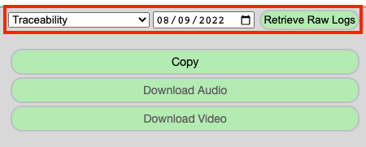
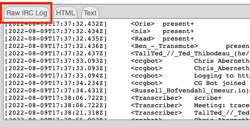
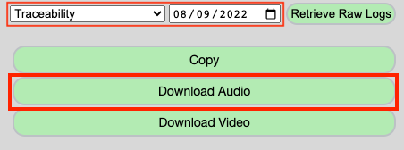
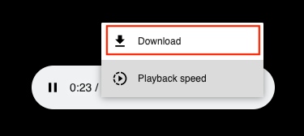
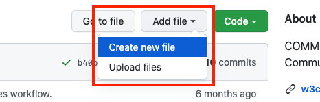
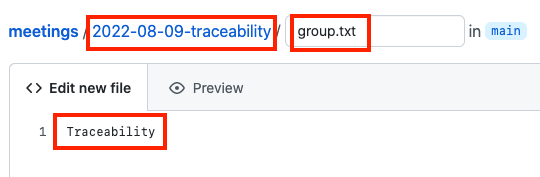
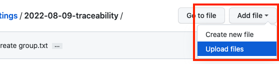
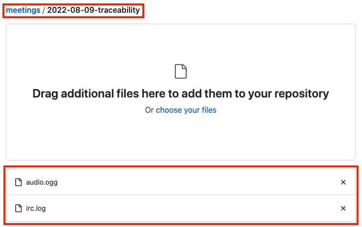
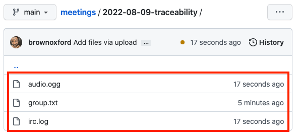

# W3C CCG Weekly Minutes

Published meeting minutes consist of three files which need to be prepared and added to the [`w3c-ccg/meetings` GitHub repository](https://github.com/w3c-ccg/meetings). This document outlines the procedures required to prepare these files and add them to the repository.

- `irc.log`
- `audio.ogg`
- `group.txt`

## Download IRC Logs

To download the IRC logs, visit the [Scribe tool](https://w3c-ccg.github.io/meetings/scribe-tool/). Select "Traceability" from the "Weekly Meeting" dropdown, enter the appropriate date in the date picker, and click "Retrieve Raw Logs". All of these UI elements are located at the bottom-right corner of the window.

Select the "Raw IRC Log" tab at the bottom-left of the display, and copy/paste the contents of the text area into a file called `irc.log`. Clean this file up as needed, e.g., to remove `s/foo/bar/` comments and any other relevant items.

## Download Audio

With the "Weekly Meeting" and date picker elements still properly filled out, click on the "Download Audio" button.

You will be redirected to a new page, which will begin playing the audio from the selected meeting. Listen for a moment to ensure that the meeting was properly recorded, then click on the vertical ellipses and select "Download" to save the `.ogg` file.

The downloaded file will have a name like `w3c-ccg-traceability-2022-08-09`, rename this file to `audio.ogg`.

## Commit `group.txt` file to GitHub

_Note that you must have appropriate permissions to add files to the `w3c-ccg/meetings` GitHub repository. If you do not have this permission level, you will be unable to add files directly._

Visit the [W3C Credentials Community Group meeting transcripts](https://github.com/w3c-ccg/meetings) GitHub repository and select "Add file" -> "Create new file".

In the `Name your file...` text box, add both a directory name and file name for the `group.txt` file. The directory name should include the appropriate date and meeting group suffix, e.g., `2022-08-09-traceability`. The contents of the file should simply be the word `Traceability`.

## Upload `irc.log` and `audio.ogg` to GitHub

From within the newly creted folder (`2022-08-09-traceability` in this example), select "Add file" -> "Upload Files"

Drag or select the `irc.log` and `audio.ogg` files that you saved earlier and commit your changes.

You should now have three files committed to the new folder, which will kick off a workflow job to handle the rest of the publishing steps.

