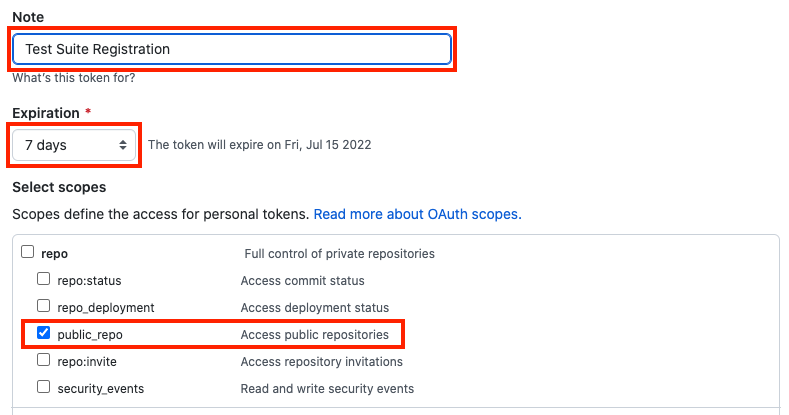

# Test Suite Registration

## Participating Organizations

The Open API for Interoperable Traceability makes use of OAuth2 authentication for most endpoints. In order to successfully run the various testing suites, a valid OAuth2 token is required. The necessary secrets used for generating this token must be securely transmitted to a repository maintainer before the test suites can be run against your organization's implementation of the API.

In order to register to participate in the test suite, please perform the following steps:

### Generate Secrets File

Create a text file called `secrets.env` with the following contents, replacing `value` with values appropriate for your organization as defined below.

```bash
CLIENT_ID=value
CLIENT_SECRET=value
TOKEN_AUDIENCE=value
TOKEN_ENDPOINT=value
API_BASE_URL=value
ORGANIZATION_DID_WEB=value
```

<dl>
  <dt><code>CLIENT_ID</code></dt>
  <dd>The client ID obtained from your OAuth service provider.</dd>
  <dt><code>CLIENT_SECRET</code></dt>
  <dd>
    <strong><em>🔥 Be especially careful with `CLIENT_SECRET`!🔥</em></strong><br> The client secret obtained from your OAuth service provider. If it is stolen, an attacker can use it to perform all API operations supported by your service provider.
  </dd>
  <dt><code>TOKEN_AUDIENCE</code></dt>
  <dd>
    This value is used to identify the service provider API that the token will be used to access. You may need to configure your identity provider and token endpoint to support this value.
  </dd>
  <dt><code>TOKEN_ENDPOINT</code></dt>
  <dd>
    This is the endpoint used to obtain an access token for Machine-to-Machine connection secured via <code>CLIENT_ID</code> and <code>CLIENT_SECRET</code>.
  </dd>
  <dt><code>API_BASE_URL</code></dt>
  <dd>The base URL for your organization's VC-API supporting DID resolution.</dd>
  <dt><code>ORGANIZATION_DID_WEB</code></dt>
  <dd>Your organization's DID Web, e.g., <code>did:web:api.did.actor:api</code></dd>
</dl>

Here is an example of what the file should look like when you are done.

```bash
ORGANIZATION_DID_WEB=did:web:vc.mesur.io:v1
CLIENT_ID=5SiSCaj8rkfbahG2xrg6nOhxVPKwDwnv
CLIENT_SECRET=**REDACTED**
TOKEN_AUDIENCE=https://vc.mesur.io/
TOKEN_ENDPOINT=https://mesur.auth0.com/oauth/token
API_BASE_URL=https://vc.mesur.io/v1
```

### Encrypt Secrets File

In order to securely transmit the secrets file to a maintainer, you will need to encrypt the file using `gpg`. If you would like more information about the command line options used with `gpg` below, please [review the online documentation](https://linux.die.net/man/1/gpg2).

```bash
# Import the public GPG encryption key
curl -sS https://raw.githubusercontent.com/w3c-ccg/traceability-interop/main/environment-setup/pubkey.asc \
  | gpg --import -

# Encrypt your secrets file with hidden recipient using the UID of the
# encryption key you just imported. If you prefer, you can also use `-a`
# to generate an ASCII output file.
gpg -e -R w3c-ccg/traceability-interop -o secrets.env.gpg secrets.env

# Whether you use `-a` or not, the entire output file must be base64 encoded
# before being sent in for test suite registration. It does not matter if your
# implementation of `base64` does or does not wrap lines.
cat secrets.env.gpg | base64 > secrets.env.gpg.b64
```

### Email Your Registration Request

Attach the encrypted and base64-encoded secrets file to an email and send it to one of the maintainers listed here:

- [Chris Abernethy](mailto:cabernet@mesur.io?subject=[GitHub]%20Traceability%20Interop%20Test%20Registration)
- [Orie Steele](mailto:orie@transmute.industries?subject=[GitHub]%20Traceability%20Interop%20Test%20Registration)
- [Michael Prorock](mailto:mprorock@mesur.io?subject=[GitHub]%20Traceability%20Interop%20Test%20Registration)
- [Mahmoud Alkhraishi](mailto:mahmoud@mavennet.com?subject=[GitHub]%20Traceability%20Interop%20Test%20Registration)

# Maintainers

If you are a repository maintainer and receive a request for registration with an attached encrypted secrets file, you can use either the `Onboard: Register` workflow or the corresponding [`onboard-register.sh`](./onboard-register.sh) script to decrypt and store the provided values in GitHub secrets.

## Using the script

If you opt to use the `onboard-register.sh` script, you will first need to ensure that you have the `gh` command line tool installed and working locally.

_Examples:_
```bash
# Register contents of secrets.b64 under prefix VENDOR_PREFIX_. This will
# fail if the secrets being registered already exist.

onboard-register.sh -p VENDOR_PREFIX_ secrets.b64

# Register contents of secrets.b64 under prefix VENDOR_PREFIX_ and
# overwrite any existing values for those secrets.

onboard-register.sh -p VENDOR_PREFIX_ -o secrets.b64
```

## Using the workflow

### GitHub Access Token

#### From the command-line using `gh`

If you have the `gh` utility installed locally, you can obtain a GitHub access token via the command line:

```bash
# First, login
gh auth login

# Next, obtain the token
gh auth status -t 2>&1 | grep Token | awk '{print $3}'
```

Use the output value as the `GitHub Token` input when running the Onboard workflows

#### Generate GitHub Personal Access Token (PAT)

If you are unable to generate a token using the `gh` utility, you can also generate a temporary PAT from the GitHub UI.

First [follow the online documentation](https://docs.github.com/en/authentication/keeping-your-account-and-data-secure/creating-a-personal-access-token) to create a PAT. Add any note you like, but be sure to include the `public_repo` scope and use a short expiration time. You will likely not be re-using this PAT very often, and should create and destroy a new PAT each time you need to import a new set of secrets.



### Import Secrets

Navigate to the `Actions` tab of the repository and click on the `Onboard: Register` workflow listed in the left hand navigation. Run this workflow in the `main` branch and, when prompted, provide your PAT, a prefix for the new variables, and the base64-encoded secrets file.

By default, this workflow will not permit you to overwrite existing secrets. This is a security measure to prevent you from overwriting something if that is not your intention. If you know what you are going, there is a checkbox labeled `Overwrite? (DANGER)` which will allow you to override the protection feature and update existing secrets.

## Update Workflows

Once secrets have been added ([check the secrets page to confirm](https://github.com/w3c-ccg/traceability-interop/settings/secrets/actions)), you will need to update individual workflows to add the new participating organization to the various test matrices.

The following example outlines what you would need to do to add an organization called `Acme` to a multi-actor matrix (assumes you have used `ACME_PRODUCTION_` as the variable prefix):

```yaml
      matrix:
        include:

          # Existing
          - name: "mesur.io-Transmute"
            issuer: MESUR_IO_PRODUCTION
            verifier: TRANSMUTE_PRODUCTION
          - name: "Transmute-mesur.io"
            issuer: TRANSMUTE_PRODUCTION
            verifier: MESUR_IO_PRODUCTION

          # You would add
          - name: "mesur.io-Acme"
            issuer: MESUR_IO_PRODUCTION
            verifier: ACME_PRODUCTION
          - name: "Acme-mesur.io"
            issuer: ACME_PRODUCTION
            verifier: MESUR_IO_PRODUCTION
          - name: "Transmute-Acme"
            issuer: TRANSMUTE_PRODUCTION
            verifier: ACME_PRODUCTION
          - name: "Acme-Transmute"
            issuer: ACME_PRODUCTION
            verifier: TRANSMUTE_PRODUCTION
```

Similar, but less complex, is this example with a single-actor matrix:

```yaml
      matrix:
        include:

          # Existing
          - name: "mesur.io"
            actor: "MESUR_IO_PRODUCTION"
          - name: "Transmute"
            actor: "TRANSMUTE_PRODUCTION"

          # You would add
          - name: "Acme"
            actor: "ACME_PRODUCTION"
```

## GPG Rotation

In the event that the GPG key used for transmission of secret material during the test suite registration process needs to be rotated, there is a workflow and a script for that.

### Using the script

If you opt to use the [`onboard-rotate.sh`](./onboard-rotate.sh) script, you will first need to ensure that you have the `gh` command line tool installed and working locally.

_Examples:_
```bash
# Rotate the GPG key and passphrase, and publish the public key.
onboard-rotate.sh
```

### Using the workflow

Again, you will need a GitHub PAT with `public_repo` scope in order to run this workflow - see the documentation above if you need to generate one.

Once you have your PAT, navigate to the `Actions` tab of the repository and click on the `Onboard: Rotate` workflow listed in the left hand navigation. Run this workflow in the `main` branch and, when prompted, provide your PAT.

This workflow will generate and store a new GPG secret key, as well as publish the public key (ascii armored) to the repository via an automated commit.
