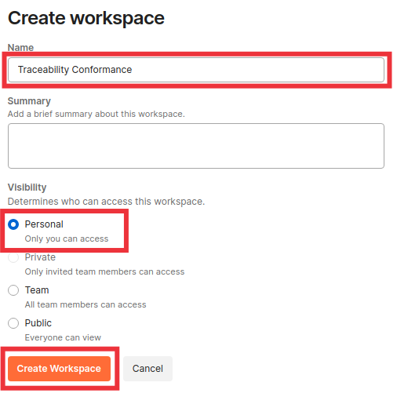
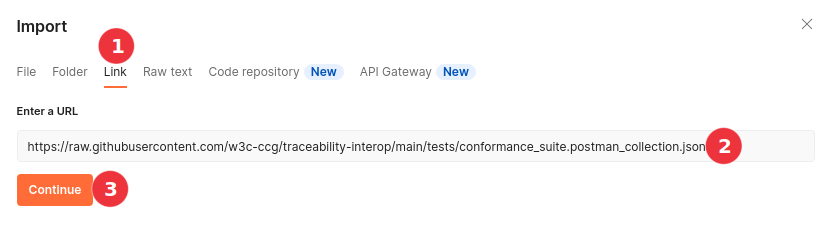
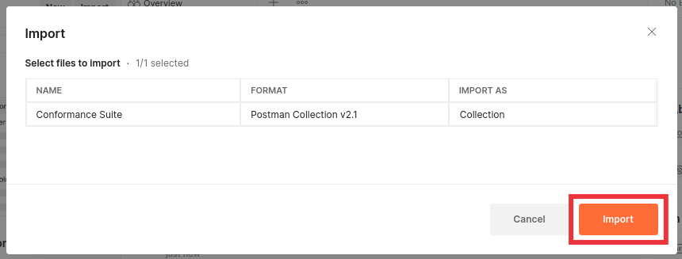
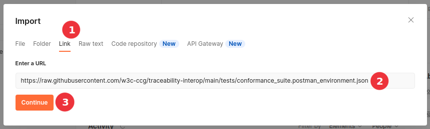
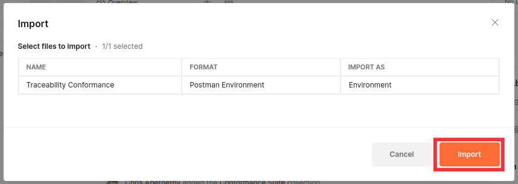

# Traceability API Conformance Testing

The Postman suite in this directory is intended to test API implmentations for
conformance against the published OpenAPI spec.

Testing is performed by making requests to an endpoint and validating response
bodies against configured schemas. Schemas are maintained in the Postman collection
by the `update_conformance_schemas.sh` script, which is run by a workflow triggered
by changes to files in the `docs/openapi` folder.

Request bodies for the "Bad Request" series of negative tests for the `/credentials/verify` endpoint are generated using the `update_conformance_vcs.js` script. This will dynamically generate invalid credentials with valid signatures, and inject them directly into the Postman suite. Output is written to standard out, and should be redirected to a temporary file before overwriting the existing Postman suite, for example:

```bash
./update_conformance_vcs.js > tmp.json
mv tmp.json conformance_suite.postman_collection.json
```

## Importing The Test Suite

### Create a workspace

Postman test suites are imported into workspaces. You may either choose an existing workspace before importing, or create a new one by opening the "Workspaces" dropdown menu at the top left of the Postman window and clicking on the "Create Workspace" button.


In the following examples, the "Traceability Conformance" workspace will be created and used.



### Import the collection

Once you have created and/or selected your workspace, use the "Import" button to import the conformance collection.


When the import modal window opens, select the "Link" option, paste the [link to the Postman collection](https://raw.githubusercontent.com/w3c-ccg/traceability-interop/main/tests/conformance_suite.postman_collection.json) in the text input, and click "Continue"



After you click "Continue", Postman will download and process the remote url and present a confirmation screen. Click the "Import" button to continue.



### Import the environment

Use the "Import" button again to import the conformance environment.


When the import modal window opens, select the "Link" option, paste the [link to the Postman environment](https://raw.githubusercontent.com/w3c-ccg/traceability-interop/main/tests/conformance_suite.postman_environment.json) in the text input, and click "Continue"



After you click "Continue", Postman will download and process the remote url and present a confirmation screen. Click the "Import" button to continue.



### Configure the environment

Once the environment finishes importing, you will need to add in the values specific to your implementation. Click on the "Environments" tab, then highlight the "Traceability Conformance" environment and update the values under the "INITIAL VALUE" column. Click "Reset All" to copy the values to the "CURRENT VALUE" column and then click "Save".


You are now ready to begin executing conformance tests against your implementation!

## Testing Notes

### Optional Elements
When a schema calls for optional elements, the base happy path test will exclude all optional items.

There will be one additional happy path test for each optional item, which will be run separately.

There will be one negative test for each optional item in which an invalid value will be used.

### Alternate Elements
When a schema calls for one of several possible values for an item, the base happy path test will include testing for the first alternate. Additional happy path tests will be created for each of the remaining alternates.

Negative tests will be created separately for each alternate item.

### Negative Type Checking
Negative testing for type checking is exhaustive over javascript types, e.g., if a schema element is defined to be an array, the conformance suite will include one test for each of the other JS types (`boolean`, `integer`, `null`, `object`, and `string`) to ensure that the request fails.

### Negative Value Checking
When a schema element is constrained to a specific set of values, negative testing will only check that the request fails for a single bad value. In this case, exhaustive testing is not feasible.
