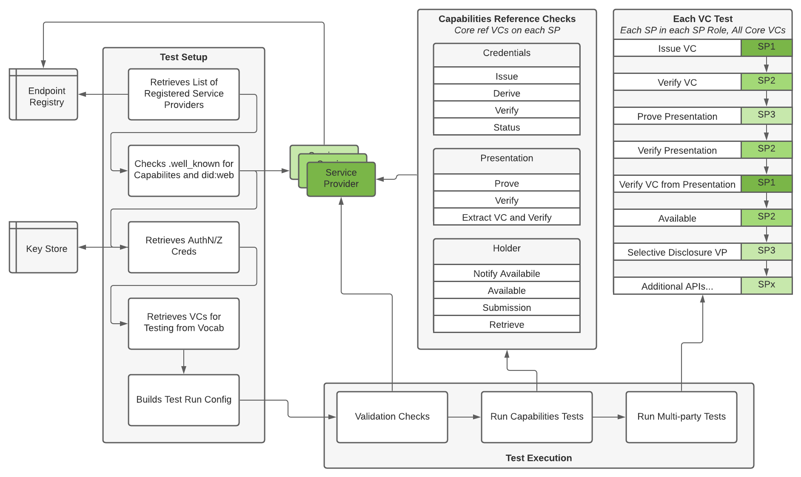

# Test Examples

This folder contains a newman/postman collection and sample input data required to test issuance of credentials from the traceability vocab against implementations of the VC-API as defined in the traceability interop profile

to execute examples from CLI:

```shell
newman run ./collections/reference/vc-http-api-supply-chain.json -d ./data/reference/vc-http-api-supply-chain-credentials.json
```

A variation of this test set will be generalized and extended out to be incorporated into CI/CD for the overall traceability specification objects

## Core Profile and Interop Tests

All APIs and configs will be tested with Newman/Postman, and additional settings (security, etc.) may be tested with other core system utilities and/or JS

This package may be executed with the following:

```bash
node .
```

Which will execute all configured tests via node

To get help on running the tests, execute:

```bash
bash$ node . -h
Traceability Interop Testing
Usage: trace-interop-test [options]

Options:
  -V, --version                  output the version number
  -s, --service <file>           use the specified service provider test collection (default: "./collections/service-providers.json")
  -r, --reference <file>         use the specified reference VC test collection (default: "./collections/reference-credentials.json")
  -sd, --servicedata <file>      use the specified service provider data collection (default: "./data/service-providers.json")
  -rd, --referencedata <file>    use the specified reference VC data collection (default: "./data/reference-credentials.json")
  -rd, --reportdir <folder>      use the specified service provider data collection (default: "./newman")
  -t, --tests <all...>           use the specified tests, "none" is provided as an option for dev purposes (choices: "all", "service", "reference", "interop", "none", default: ["all"])
  -d, --dids <key, web, all...>  use the specified did methods (default: ["key"])
  -n, --names <all...>           test only the service provider as identified by name (default: ["all"])
  -v, --verbose                  verbose reporting
  -dev, --dev                    dev mode for advanced options
  -h, --help                     display help for command
```

### Some options of note

To just run your tests against a specific did method, specify only your "name" from the `./data/service-providers.json` along with the desired did method, such as `key`

```bash
bash$ node . -n "mesur.io" -d key
Traceability Interop Testing
Liveness check starting...
Quick liveness tests on service providers...
Checking mesur.io
    https://mesur.io true
    https://vc.mesur.io/.well-known/did-configuration.json true
 * mesur.io is alive.
Skipping Transmute due to config
Skipping Mavennet due to config
Liveness check complete.

Skipping Transmute
Skipping Mavennet
Traceability Interop: Reference Credential tests complete
Using htmlextra version 1.22.3
Traceability Interop: Reference Credential test complete: mesur.io   did: key
Using htmlextra version 1.22.3
Traceability Interop: Service Provider test complete
```

This will generate test files in the specified output directory (defaults to `./newman`) like so:

```bash
$ tree -L 3 newman/
newman/
├── service-provider-report.html
├── service-provider-report.json
└── vc.mesur.io
    ├── key-reference-credentials-report.html
    └── key-reference-credentials-report.json
```

Note that the baseline tests are summarized at the top level across providers in `service-provider-report.[html|json]` and that there is
a directory created for each tested provider which contains test results against that provider.

JSON output is available for all tests and may be combined for analytics individually or across providers.

`-v` will not only provide additional command line logging, but will also turn on the `CLI` reporter for newman so that you can view test execution in real time as well as summaries at the end of test iteration.

## Test folder structure

```bash
├── bin - binary folder for cli test execution and integration into CI
├── collections - postman collections
│   └── reference - postman examples related to this test suite
└── data - data packages for use with the postman collections
    └── reference - examples
```

The basic test flow is outlined in the diagram below:


This test suite provides core postman collections for testing on interop. We will begin with the following:

- `service-providers.json` : does the service provider meet baseline functionality
- `reference-credentials.json` : can the service provider issue, verify, etc., with a known set of good credentials
- `interop-credentials.json` : can the service provider act in all required roles -- 1) issuer, 2) verifier, 3) holder -- with a known set of credentials from the trace vocab

## Base Service Provider Config and Profile Tests

To execute the base service provider tests from CLI, execute the following:

```shell
newman run ./collections/service-providers.json -d ./data/service-providers.json -r html,json[,cli] --reporter-json-export ./newman/service-provider-report.json
```

## Reference Credential and baseline VC-API Tests

To execute the baseline tests against the VC-API from CLI execute the following:

```shell
newman run ./collections/reference-credentials.json -d ./data/reference-credentials.json -r html,json[,cli] --reporter-json-export ./newman/reference-credentials-report.json
```

## Importing Collections into Postman

To import the collections into Postman, follow the guide on [importing Postman data](https://learning.postman.com/docs/getting-started/importing-and-exporting-data/#importing-data-into-postman)

## OAuth 2.0 Configuration

Postman tests make use of OAuth 2.0 client credentials flow for authentication, which may result in a billable event for configured authentication providers.

### Client Credentials Grant

In order to obtain an access token via `client_credentials` grant, each service provider configured in `data/service-providers.json` must include values for `oauth2.access_token_url` and `oauth2.client_id`. The required `client_secret` will be provided in the runtime environment by GitHub Actions reading from encrypted secrets (see below for details).

_NB: Secrets are not passed to the runner when a workflow is triggered from a forked repository, so tests that rely on OAuth client credentials grants may fail if triggered on pull requests._

### Generating Secret Name

OAuth 2.0 `client_secret` values are stored as GitHub repository-level secrets using a name generated by a repeatable transformation on the corresponding `client_id`. This allows the secret to be programatically associated with the OAuth client being used for a request.

GitHub secrets have [constraints](https://docs.github.com/en/actions/security-guides/encrypted-secrets#naming-your-secrets) on uniqueness and character content which are satisfied by a hexidecimal string not beginning with a number, so secret names are generated using the SHA256 hash of the `client_id` prefixed with `CLIENT_SECRET_`

### Providing Secrets

Values for `client_secret` should be encrypted with GPG and provided to one of the repository maintainers so that it can be added as a GitHub secret.

_(This section needs more details, along with a public key for a volunteer maintainer)_
