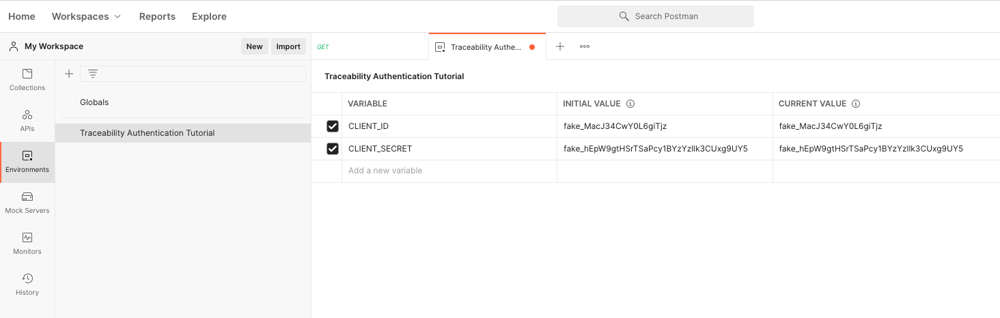

# Traceability Authentication Tutorial

This tutorial describes how to obtain an access token.

First step is to download and install [Postman](https://www.postman.com/).

You will also want to download and install [Newman](https://learning.postman.com/docs/running-collections/using-newman-cli/command-line-integration-with-newman/).

If you are not familar with Postman, we recommend you complete the first few section of their learning center from the link above.

## Getting Started

### Setting Up Your Environment

Create a new Postman environment.


Name your new environment "Traceability Authentication Tutorial"

Next, you will want to add a few environment variables.

Please review [Oauth.com Documentation](https://www.oauth.com/oauth2-servers/client-registration/client-id-secret/) before proceeding.

#### CLIENT_ID

Create a new environment variable called `CLIENT_ID`.

You will need to define a Postman Environment value that will contain the `CLIENT_ID` you have obtained from your service provider.


#### CLIENT_SECRET

Create a new environment variable called `CLIENT_SECRET`.

You will need to define a Postman Environment value that will contain the `CLIENT_SECRET` you have obtained from your service provider.

🔥 Be especially careful with `CLIENT_SECRET`. 🔥

If it is stolen it will allow an attacker the ability to perform all api operations supported by your service provider.



#### TOKEN_ENDPOINT

This is the endpoint used to obtain an access token for Machine to Machine connection secured via `CLIENT_ID` and `CLIENT_SECRET`.

If you use Auth0, it will look something like this:

```
https://TENANT_NAME.us.auth0.com/oauth/token
```

#### TOKEN_AUDIENCE

Create a new environment variable called `TOKEN_AUDIENCE`.

This value is used to identify the service provider API that the token will be used to access.

You may need to configure your identity provider and token endpoint to support this value.

```
https://platform.example
```

#### API_BASE_URL

Create a new environment variable called `API_BASE_URL`.

This value is used to identify the base URL that will be used when making authenticated network requests.

This value should look similar to `TOKEN_AUDIENCE`

```
https://platform.example/v2
```


### Setting Up Your Collection

Create a new postman collection called "Traceability Authentication Tutorial".


#### Get Your Application Access Token

Create a new postman network request in the collection called "Get Access Token".

```
POST {{TOKEN_ENDPOINT}}
```

Make sure to set the `Accept` header to `application/json`.

Make sure to se the body to:

```json
{
  "audience": "{{TOKEN_AUDIENCE}}",
  "client_id": "{{CLIENT_ID}}",
  "client_secret": "{{CLIENT_SECRET}}",
  "grant_type": "client_credentials"
}
```

The last step is to add a "Test" which will capture the access token for future use.

```js
pm.environment.set('access_token', pm.response.json().access_token);
```

After setting these values, run the request and confirm that your environment now has a new set variable for `access_token`.

#### Verifying a Credential

Now that you have authenticated as an application, you are ready to make your first authenticated API network request.

Create a new request in your collect called "Verify Credential"

Set the endpoint to be:

```
POST {{API_BASE_URL}}/credentials/verify
```

Make sure to set the `Accept` header to `application/json`.
Make sure to set the `Authorization` to the `{{access_token}}`.


Set the post body to :

```json
{
  "verifiableCredential": {
    "@context": ["https://www.w3.org/2018/credentials/v1", { "@vocab": "https://ontology.example/" }],
    "id": "urn:uuid:07aa969e-b40d-4c1b-ab46-ded252003ded",
    "type": ["VerifiableCredential"],
    "issuer": "did:key:z6MktiSzqF9kqwdU8VkdBKx56EYzXfpgnNPUAGznpicNiWfn",
    "issuanceDate": "2010-01-01T19:23:24Z",
    "credentialSubject": { "id": "did:example:123", "description": "Hello World" },
    "proof": {
      "type": "Ed25519Signature2018",
      "created": "2022-02-04T20:16:43Z",
      "verificationMethod": "did:key:z6MktiSzqF9kqwdU8VkdBKx56EYzXfpgnNPUAGznpicNiWfn#z6MktiSzqF9kqwdU8VkdBKx56EYzXfpgnNPUAGznpicNiWfn",
      "proofPurpose": "assertionMethod",
      "jws": "eyJhbGciOiJFZERTQSIsImI2NCI6ZmFsc2UsImNyaXQiOlsiYjY0Il19..BlEELuh9Sxdglp7msEJVzXgKqij-T-4Cs0Bbw5B8pWQvOpXzrdNXuHvd982NseVoI2AbMt6WhxC38PM7ikFlBQ"
    }
  }
}
```

Next test the test to confirm that the credential was verified successfully:

```js
pm.test('The response confirms the credential was verified successfully', () => {
  // parse the response JSON and test two properties
  const responseJson = pm.response.json();
  pm.expect(responseJson.errors).to.eql([]);
});
```

Make sure to save the network request.

Make sure to run the "Get Access Token" request first, so that the token can be used to verify the credential.

Run the "Verify Credential" network request.

You should see a single green test is passing.


### Running Collections from Command Line

Export your collection to a file called "authentication-tutorial.collection.json".

Place the file in `./docs/tutorials/authenticate/authentication-tutorial.collection.json`

Change directory to that folder:

```sh
cd  ./docs/tutorials/authenticate
```

Copy `example.env` and rename it to something related to your service provider, such as `provider-name.env`.

Update all the values to match the ones you set in postman.

Run your collection by command line using he following command:

```sh
source provider-name.env && \
newman run ./authentication-tutorial.collection.json \
--env-var CLIENT_ID=$CLIENT_ID \
--env-var CLIENT_SECRET=$CLIENT_SECRET \
--env-var TOKEN_AUDIENCE=$TOKEN_AUDIENCE \
--env-var TOKEN_ENDPOINT=$TOKEN_ENDPOINT \
--env-var API_BASE_URL=$API_BASE_URL \
--reporters cli,json \
--reporter-json-export ./authentication-tutorial.collection.report.json
```

This should produce a JSON test suite report in the same directory.

As a final step, if you are an active contributor to this repo,
you may register your api to be automatically tested via GitHub actions.

See [authentication-tutorial.yml](../../../.github/workflows/authentication-tutorial.yml).
