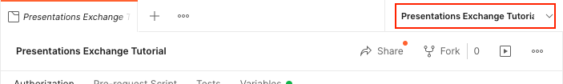
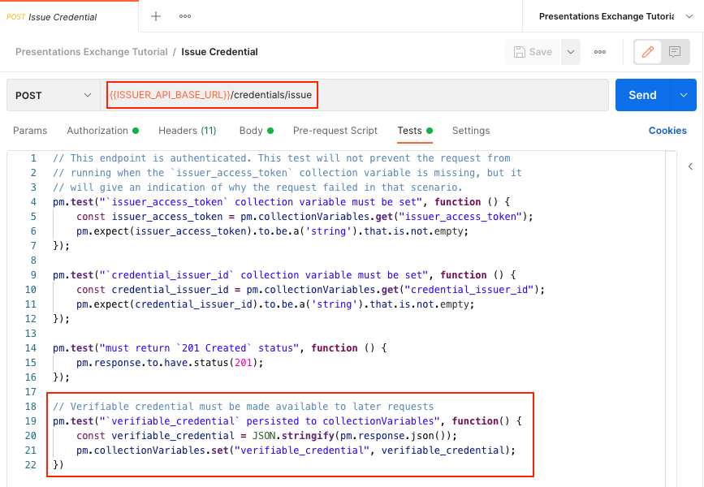
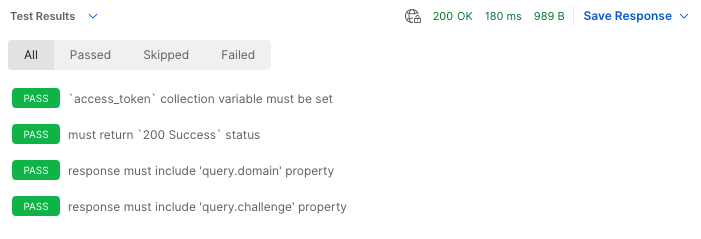
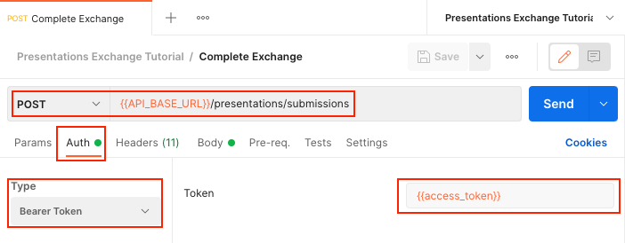

# Presentations Exchange Tutorial

If you have not done so already, please review and complete the previous tutorials which form the foundation for the material presented in this tutorial.

1. [Authentication Tutorial](../authentication/README.md) - Obtain an OAuth2 client credentials grant token
1. [Did Web Discovery Tutorial](../did-web-discovery/README.md) - Get Organization identifiers and VC-API service endpoint
1. [Credentials Issue Tutorial](../credentials-issue/README.md) - Issue a verifiable credential

In this tutorial we will use the OAuth token from the Authentication Tutorial to make an authenticated call to a VC-API service endpoint obtained from the Did Web Discovery Tutorial to start a presentation exchange workflow by creating a verifiable presentation.

## Setup and Configuration

This tutorial will be picking up where the Credentials Issue Tutorial left off; the quickest way to get set up to work on this tutorial is to:

1. Duplicate the "Credentials Issue Tutorial" collection and rename it to "Presentations Exchange Tutorial".
1. Duplicate the "Credentials Issue Tutorial" environment and rename it to "Presentations Exchange Tutorial".

Be sure to activate the new "Presentations Exchange Tutorial" environment by selecting it in the drop-down menu at the top-right of the Postman interface.



This tutorial is different from previous tutorials in that it involves two different providers. In order to facilitate this multi-provider approach, we will need to obtain access tokens and organization DIDs for each of the two providers.

## Get Access Token

First, modify the "Get Access Token" request to be specific to the provider acting as the "Issuer" in this tutorial.

Open up the "Get Access Token" request in the "Credentials Issue Tutorial" collection and make the following changes:

1. Rename the request to "Get Access Token (Issuer)".
1. Change the request URL from `{{TOKEN_ENDPOINT}}` to `{{ISSUER_TOKEN_ENDPOINT}}`.
1. In the "Body" tab, update the request body to add an `ISSUER_` prefix to the referenced environment variables:
    ```
    {
        "audience": "{{ISSUER_TOKEN_AUDIENCE}}",
        "client_id": "{{ISSUER_CLIENT_ID}}",
        "client_secret": "{{ISSUER_CLIENT_SECRET}}",
        "grant_type": "client_credentials"
    }
    ```
1. In the "Tests" tab, replace the last "`access_token` persisted to collectionVariables" test with the following issuer-specific code:
    ```
    // The returned `access_token` value is persisted as a Postman collection
    // variable that can be accessed by other requests in the collection by calling
    // `pm.collectionVariables.get("issuer_access_token")`.
    pm.test("`access_token` persisted to collectionVariables", function() {
        const { access_token } = pm.response.json()
        pm.collectionVariables.set("issuer_access_token", access_token);
    });
    ```

Next, duplicate the "Get Access Token (Issuer)" request and modify it to be verifier-specific:

1. Rename the request to "Get Access Token (Verifier)".
1. Change the request URL from `{{TOKEN_ENDPOINT}}` to `{{VERIFIER_TOKEN_ENDPOINT}}`.
1. In the "Body" tab, update the request body to add an `VERIFIER_` prefix to the referenced environment variables:
    ```
    {
        "audience": "{{VERIFIER_TOKEN_AUDIENCE}}",
        "client_id": "{{VERIFIER_CLIENT_ID}}",
        "client_secret": "{{VERIFIER_CLIENT_SECRET}}",
        "grant_type": "client_credentials"
    }
    ```
1. In the "Tests" tab, replace the last "`access_token` persisted to collectionVariables" test with the following verifier-specific code:
    ```
    // The returned `access_token` value is persisted as a Postman collection
    // variable that can be accessed by other requests in the collection by calling
    // `pm.collectionVariables.get("verifier_access_token")`.
    pm.test("`access_token` persisted to collectionVariables", function() {
        const { access_token } = pm.response.json()
        pm.collectionVariables.set("verifier_access_token", access_token);
    });
    ```

## Get Organization DIDs

You will need to duplicate the "Get Organization DIDs" request into Issuer and Verifier versions, just like you did for the "Get Access Token" request.

First, modify the "Get Organization DIDs" request to be specific to the provider acting as the "Issuer" in this tutorial.

Open up the "Get Organization DIDs" request in the "Credentials Issue Tutorial" collection and make the following changes:

1. Rename the request to "Get Organization DIDs (Issuer)".
1. Change the request URL from `{{API_BASE_URL}}/identifiers/{{ORGANIZATION_DID_WEB}}` to `{{ISSUER_API_BASE_URL}}/identifiers/{{ISSUER_ORGANIZATION_DID_WEB}}`.
1. In the "Auth" tab, change the token value from `{{access_token}}` to `{{issuer_access_token}}`.
1. In the "Tests" tab, replace the "`access_token` collection variable must be set" test with the following issuer-specific code:
    ```javascript
    // This endpoint is authenticated. This test will not prevent the request from
    // running when the `issuer_access_token` collection variable is missing, but it
    // will give an indication of why the request failed in that scenario.
    pm.test("`issuer_access_token` collection variable must be set", function () {
        const issuer_access_token = pm.collectionVariables.get("issuer_access_token");
        pm.expect(issuer_access_token).to.be.a('string').that.is.not.empty;
    });
    ```

Next, duplicate the "Get Organization DIDs (Issuer)" request and modify it to be verifier-specific:

1. Rename the request to "Get Organization DIDs (Verifier)".
1. Change the request URL from `{{API_BASE_URL}}/identifiers/{{ORGANIZATION_DID_WEB}}` to `{{VERIFIER_API_BASE_URL}}/identifiers/{{VERIFIER_ORGANIZATION_DID_WEB}}`.
1. In the "Auth" tab, change the token value from `{{access_token}}` to `{{verifier_access_token}}`.
1. In the "Tests" tab, replace the "`access_token` collection variable must be set" test with the following verifier-specific code:
    ```javascript
    // This endpoint is authenticated. This test will not prevent the request from
    // running when the `verifier_access_token` collection variable is missing, but it
    // will give an indication of why the request failed in that scenario.
    pm.test("`verifier_access_token` collection variable must be set", function () {
        const verifier_access_token = pm.collectionVariables.get("verifier_access_token");
        pm.expect(verifier_access_token).to.be.a('string').that.is.not.empty;
    });
    ```
    Additionally, for the "Verifier" version the following additional test must be added:
    ```javascript
    // The serviceEndpoint for the verifier must be persisted for later use
    pm.test("`verifier_exchange_endpoint` is persisted to collectionVariables", function() {
        const { service } = pm.response.json().didDocument;
        const entry = service.find((s) => s.type == "TraceabilityAPI");
        pm.collectionVariables.set("verifier_exchange_endpoint", entry.serviceEndpoint);
    });
    ```

## Issue Credential

The "Issue Credential" request must be modified to use the issuer base URL and to preserve the output of the Issue Credential request so that we can use that credential in later steps.

First, open up the "Issue Credential" request in the "Credentials Issue Tutorial" and change the request URL from `{{API_BASE_URL}}/credentials/issue` to `{{ISSUER_API_BASE_URL}}/credentials/issue`.

Next, select the "Tests" tab; Add the following code to the end of the test so that the verifiable credential JSON is stored as a collection variable:

```javascript
// Verifiable credential must be made available to later requests
pm.test("`verifiable_credential` persisted to collectionVariables", function() {
    const verifiable_credential = JSON.stringify(pm.response.json());
    pm.collectionVariables.set("verifiable_credential", verifiable_credential);
})
```

When you are done, the "Tests" tab should look something like this:



You will need to run this request at least once in order to populate the `verifiable_credential` collection variable before you can proceed with the next request.

## Initiate Presentation Exchange Flow

In order to start a presentation exchange flow, appropriate values for `domain` and `challenge` need to be obtained from the API server via a request to the `/presentations/available` endpoint.

### Environment

No new environment variables will be needed for this tutorial, however, because this test now involves separate Issuer and Verifier actors, you will need to duplicate all of the environment variables currently in place and ensure that they are properly named. When you are done, you should have all of the following in the "Presentations Exchange Tutorial" environment.

#### Issuer Variables

<dl>
  <dt><code>ISSUER_API_BASE_URL</code></dt>
  <dd>The base URL for your organization's VC-API supporting DID resolution.</dd>
  <dt><code>ISSUER_ORGANIZATION_DID_WEB</code></dt>
  <dd>Your organization's DID Web, e.g., <code>did:web:api.did.actor:api</code></dd>
  <dt><code>ISSUER_CLIENT_ID</code></dt>
  <dd>The client ID obtained from your OAuth service provider.</dd>
  <dt><code>ISSUER_CLIENT_SECRET</code></dt>
  <dd>
    The client secret obtained from your OAuth service provider. 🔥 Be especially careful with `ISSUER_CLIENT_SECRET`🔥, If it is stolen it will allow an attacker the ability to perform all api operations supported by your service provider.
  </dd>
  <dt><code>ISSUER_TOKEN_AUDIENCE</code></dt>
  <dd>
    This value is used to identify the service provider API that the token will be used to access. You may need to configure your identity provider and token endpoint to support this value.
  </dd>
  <dt><code>ISSUER_TOKEN_ENDPOINT</code></dt>
  <dd>
    This is the endpoint used to obtain an access token for Machine to Machine connection secured via <code>ISSUER_CLIENT_ID</code> and <code>ISSUER_CLIENT_SECRET</code>.
  </dd>
</dl>

#### Verifier Variables

<dl>
  <dt><code>VERIFIER_API_BASE_URL</code></dt>
  <dd>The base URL for your organization's VC-API supporting DID resolution.</dd>
  <dt><code>VERIFIER_ORGANIZATION_DID_WEB</code></dt>
  <dd>Your organization's DID Web, e.g., <code>did:web:api.did.actor:api</code></dd>
  <dt><code>VERIFIER_CLIENT_ID</code></dt>
  <dd>The client ID obtained from your OAuth service provider.</dd>
  <dt><code>VERIFIER_CLIENT_SECRET</code></dt>
  <dd>
    The client secret obtained from your OAuth service provider. 🔥 Be especially careful with `VERIFIER_CLIENT_SECRET`🔥, If it is stolen it will allow an attacker the ability to perform all api operations supported by your service provider.
  </dd>
  <dt><code>VERIFIER_TOKEN_AUDIENCE</code></dt>
  <dd>
    This value is used to identify the service provider API that the token will be used to access. You may need to configure your identity provider and token endpoint to support this value.
  </dd>
  <dt><code>VERIFIER_TOKEN_ENDPOINT</code></dt>
  <dd>
    This is the endpoint used to obtain an access token for Machine to Machine connection secured via <code>VERIFIER_CLIENT_ID</code> and <code>VERIFIER_CLIENT_SECRET</code>.
  </dd>
</dl>

### Request

Create a new `POST` request called "Initiate Exchange" in the "Presentations Exchange Tutorial" collection.

* Set the request URL to `{{verifier_exchange_endpoint}}/presentations/available`.
* In the "Auth" tab, select "Bearer Token" set the "Token" value to `{{verifier_access_token}}`.
* In the "Headers" tab, dd an `Accept` header with the value `application/json`.
* In the body tab, add the following raw JSON:
  ```json
  {
    "query": [
      {
        "type": "QueryByExample",
        "credentialQuery": [
          {
            "type": [
              "VerifiableCredential"
            ],
            "reason": "We want to present credentials."
          }
        ]
      }
    ]
  }
  ```

When you are done, your request should look something like this:


### Testing

The "Initiate Exchange" request is part of the system under test, and as such the interaction must be validated using Postman tests.

The following code should be added to the "Initiate Exchange" request in the "Tests" tab:

```javascript
// This endpoint is authenticated. This test will not prevent the request from
// running when the `verifier_access_token` collection variable is missing, but
// it will give an indication of why the request failed in that scenario.
pm.test("`verifier_access_token` collection variable must be set", function () {
    const verifier_access_token = pm.collectionVariables.get("verifier_access_token");
    pm.expect(verifier_access_token).to.be.a('string').that.is.not.empty;
});

// The expected response code for a "Presentations Available" request is
// `200 Success`.
pm.test("must return `200 Success` status", function () {
    pm.response.to.have.status(200);
});

// The response body must include a "domain" property.
pm.test("response must include 'domain' property", function() {
    const { domain } = pm.response.json()
    pm.expect(domain).to.be.a('string').that.is.not.empty;
    // Domain must be made available to later requests
    pm.collectionVariables.set("domain", domain);
});

// The response body must include a "challenge" property.
pm.test("response must include 'challenge' property", function() {
    const { challenge } = pm.response.json()
    pm.expect(challenge).to.be.a('string').that.is.not.empty;
    // Challenge must be made available to later requests
    pm.collectionVariables.set("challenge", challenge);
});

```

### Running the Request

You can now click the blue "Send" button to make the "Initiate Exchange" request. If everything works properly, you should receive a response that looks something like this:


If you switch the "Body" dropdown to "Test Results", you should see all tests passing. If any of your tests are failing, you will need to address the underlying issues before moving forward.



## Sign Presentation

The next step in the presentation exchange flow is to create a signed presentation using the previously issued VC and the `domain` and `challenge` values from the "Initiate Exchange" request.

### Environment

No additional environment variables are needed for this request, all required environment variables were set during the tutorial steps for previous requests.

### Request

Create a new `POST` request called "Sign Presentation" in the "Presentations Exchange Tutorial" collection.

* Set the request URL to `{{ISSUER_API_BASE_URL}}/presentations/prove`.
* In the "Auth" tab, select "Bearer Token" set the "Token" value to `{{issuer_access_token}}`.
* In the "Headers" tab, dd an `Accept` header with the value `application/json`.
* In the body tab, add the following raw JSON:
  ```json
  {
      "presentation": {
          "@context": [
              "https://www.w3.org/2018/credentials/v1"
          ],
          "type": [
              "VerifiablePresentation"
          ],
          "holder": "{{credential_issuer_id}}",
          "verifiableCredential": [
              {{verifiable_credential}}
          ]
      },
      "options": {
          "domain": "{{domain}}",
          "challenge": "{{challenge}}"
      }
  }
  ```

When you are done, your request should look something like this:


### Testing

The "Sign Presentation" request is part of the system under test, and as such the interaction must be validated using Postman tests.

The following code should be added to the "Sign Presentation" request in the "Tests" tab:

```javascript
// This endpoint is authenticated. This test will not prevent the request from
// running when the `issuer_access_token` collection variable is missing, but it
// will give an indication of why the request failed in that scenario.
pm.test("`issuer_access_token` collection variable must be set", function () {
    const issuer_access_token = pm.collectionVariables.get("issuer_access_token");
    pm.expect(issuer_access_token).to.be.a('string').that.is.not.empty;
});

// Credential issuer id is a required element item used in the request body
pm.test("`credential_issuer_id` collection variable must be set", function () {
    const credential_issuer_id = pm.collectionVariables.get("credential_issuer_id");
    pm.expect(credential_issuer_id).to.be.a('string').that.is.not.empty;
});

// Verifiable credential is a required element item used in the request body
pm.test("`verifiable_credential` collection variable must be set", function () {
    const verifiable_credential = pm.collectionVariables.get("verifiable_credential");
    pm.expect(verifiable_credential).to.be.a('string').that.is.not.empty;
});

// Domain is a required element item used in the request body
pm.test("`domain` collection variable must be set", function () {
    const domain = pm.collectionVariables.get("domain");
    pm.expect(domain).to.be.a('string').that.is.not.empty;
});

// Challenge is a required element item used in the request body
pm.test("`challenge` collection variable must be set", function () {
    const challenge = pm.collectionVariables.get("challenge");
    pm.expect(challenge).to.be.a('string').that.is.not.empty;
});

// The expected response code for a "Sign Presentation" request is
// `201 Success`.
pm.test("must return `201 Success` status", function () {
    pm.response.to.have.status(201);
});

// Verifiable presentation must be made available to later requests
pm.test("`verifiable_presentation` persisted to collectionVariables", function() {
    const verifiable_presentation = JSON.stringify(pm.response.json());
    pm.collectionVariables.set("verifiable_presentation", verifiable_presentation);
})
```

### Running the Request

You can now click the blue "Send" button to make the "Sign Presentation" request. If everything works properly, you should receive a response that looks something like this:


If you switch the "Body" dropdown to "Test Results", you should see all tests passing. If any of your tests are failing, you will need to address the underlying issues before moving forward.


## Complete Presentation Exchange Flow

In order to complete a presentation exchange, the signed presentation must be submitted.

### Environment

No additional environment variables are needed for this request, all required environment variables were set during the tutorial steps for previous requests.

### Request

Create a new `POST` request called "Complete Exchange" in the "Presentations Exchange Tutorial" collection.

* Set the request URL to `{{verifier_exchange_endpoint}}/presentations/submissions`.
* In the "Auth" tab, select "Bearer Token" set the "Token" value to `{{verifier_access_token}}`.
* In the "Headers" tab, dd an `Accept` header with the value `application/json`.
* In the body tab, add the following raw JSON:
  ```json
  {{verifiable_presentation}}
  ```

When you are done, your request should look something like this:




### Testing

The "Complete Exchange" request is part of the system under test, and as such the interaction must be validated using Postman tests.

The following code should be added to the "Complete Exchange" request in the "Tests" tab:

```javascript
// This endpoint is authenticated. This test will not prevent the request from
// running when the `verifier_access_token` collection variable is missing, but
// it will give an indication of why the request failed in that scenario.
pm.test("`verifier_access_token` collection variable must be set", function () {
    const verifier_access_token = pm.collectionVariables.get("verifier_access_token");
    pm.expect(verifier_access_token).to.be.a('string').that.is.not.empty;
});

// The expected response code for a "Complete Exchange" request is
// `200 Success`.
pm.test("must return `200 Success` status", function () {
    pm.response.to.have.status(200);
});

// Response should confirm the submission is accepted.
pm.test("verification response should be 'true'", function() {
    const { verified } = pm.response.json()
    pm.expect(verified).to.be.true;
});
```

### Running the Request

You can now click the blue "Send" button to make the "Complete Presentation" request. If everything works properly, you should receive a response that looks something like this:


If you switch the "Body" dropdown to "Test Results", you should see all tests passing. If any of your tests are failing (like in the following example), you will need to address the underlying issues before moving forward.


## Development

The postman collection can be run from the colland-line using `newman` and a local `.env` file containing your organizations secrets.

_Example: Run postman collection from the command-line_
```sh
source .env && \
npx newman run ./presentations-exchange.postman_collection.json \
--env-var ISSUER_ORGANIZATION_DID_WEB=$ISSUER_ORGANIZATION_DID_WEB \
--env-var ISSUER_CLIENT_ID=$ISSUER_CLIENT_ID \
--env-var ISSUER_CLIENT_SECRET=$ISSUER_CLIENT_SECRET \
--env-var ISSUER_TOKEN_AUDIENCE=$ISSUER_TOKEN_AUDIENCE \
--env-var ISSUER_TOKEN_ENDPOINT=$ISSUER_TOKEN_ENDPOINT \
--env-var ISSUER_API_BASE_URL=$ISSUER_API_BASE_URL \
--env-var VERIFIER_ORGANIZATION_DID_WEB=$VERIFIER_ORGANIZATION_DID_WEB \
--env-var VERIFIER_CLIENT_ID=$VERIFIER_CLIENT_ID \
--env-var VERIFIER_CLIENT_SECRET=$VERIFIER_CLIENT_SECRET \
--env-var VERIFIER_TOKEN_AUDIENCE=$VERIFIER_TOKEN_AUDIENCE \
--env-var VERIFIER_TOKEN_ENDPOINT=$VERIFIER_TOKEN_ENDPOINT \
--env-var VERIFIER_API_BASE_URL=$VERIFIER_API_BASE_URL \
--reporters cli,json
```
